可以使用浏览器对示波器访问，再浏览器中输入示波器的IP地址，下面以[http://192.168.57.229/](http://192.168.57.229/)为例。

**TODO:** IP地址待定

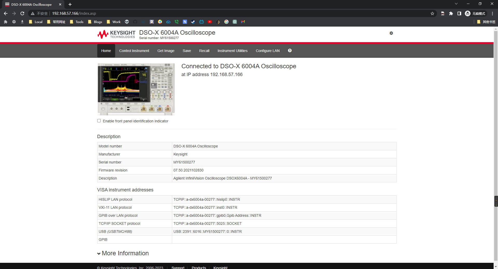

## 获取示波器上当前的图像

* 方法一: 点击 "Get Image"， 选择 "Refresh Image", 右键另存为图像
* 方法二: 点击 "Save"， 再"Filename"中输入文件名，如"abc"，按需"Format"中的保存选项，点击"Save"（可以先点击"Preview"预览）。

## 使用浏览器控制示波器

1. 点击 "Control Instrument" 中的 "Use Remote Front Panel"，将会弹出示波器的显示界面

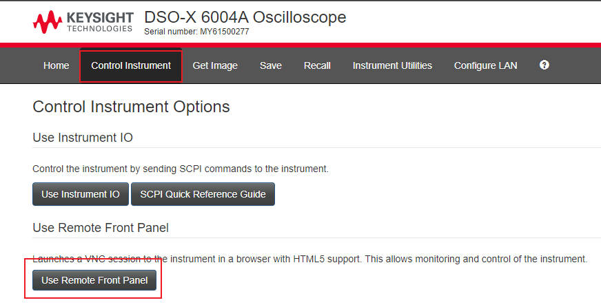
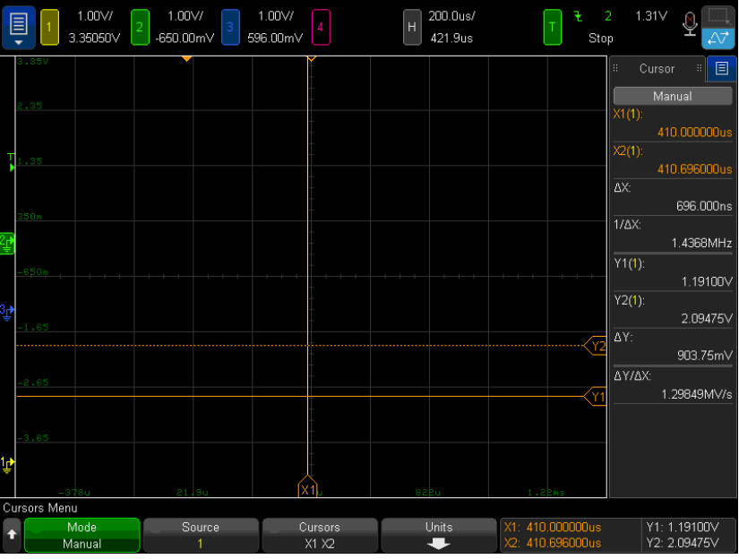

2. 在示波器的显示界面中，控制方式与触摸屏完全相同.

点击左上角的图标，可实现"Autoscale","Run/Stop","Single"等与按钮完全相同的功能

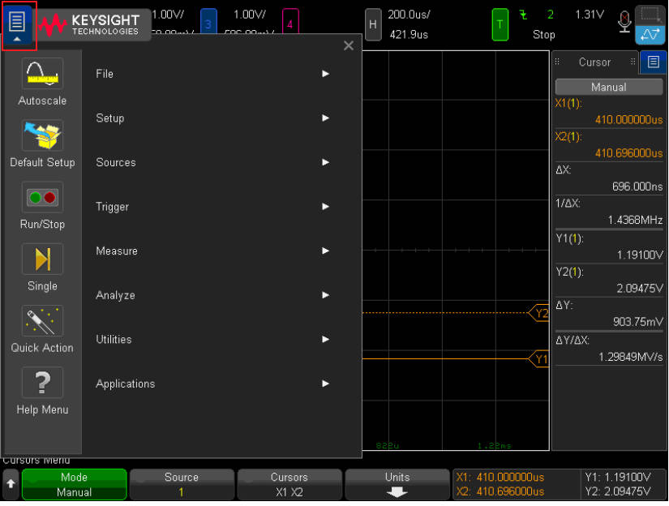
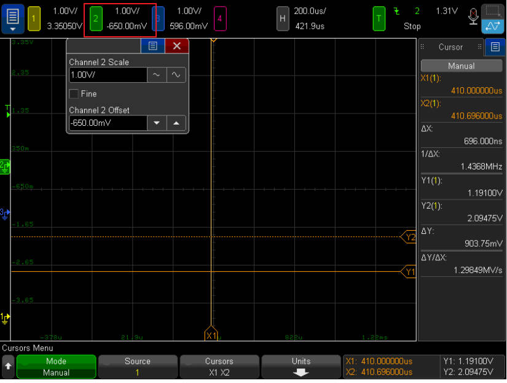
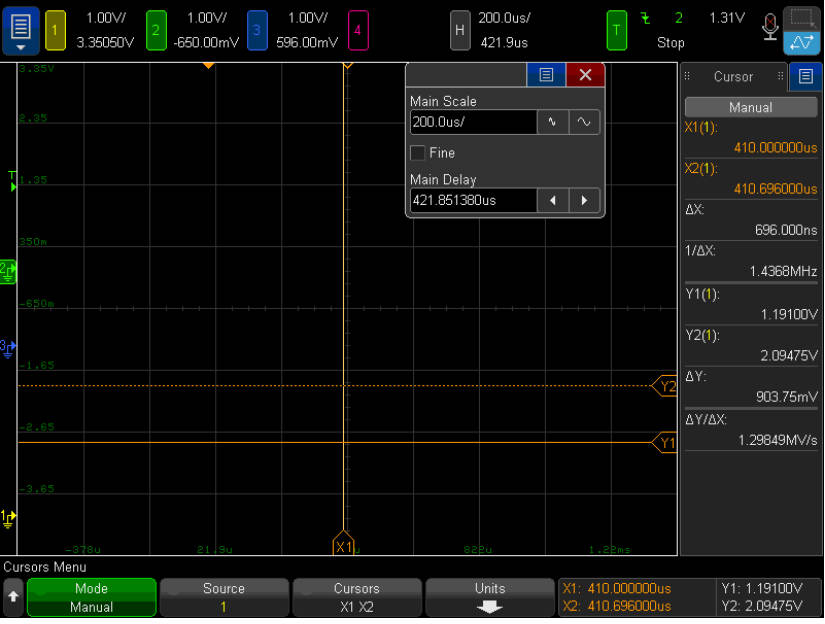
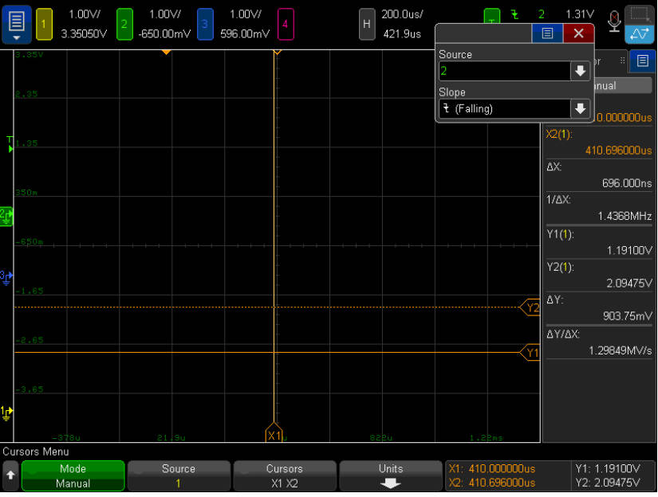

## 获取示波器的IP

默认状态下，示波器的IP通过DHCP自动获取，按示波器上的"Utility", 在屏幕上点击"I/O",可以在弹出的界面中查看IP地址

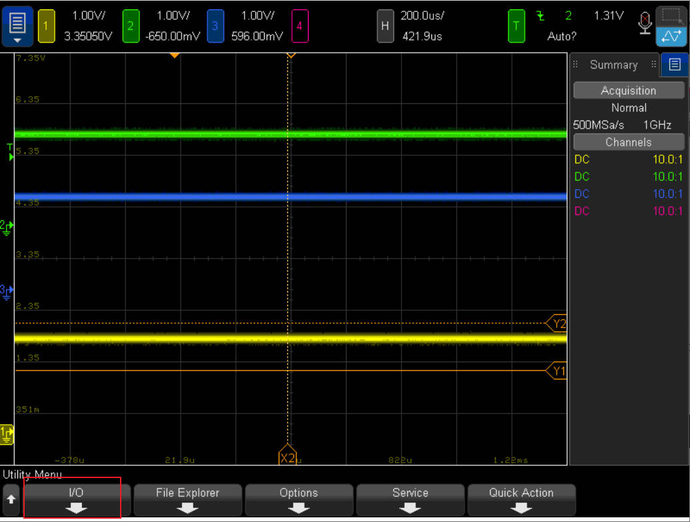
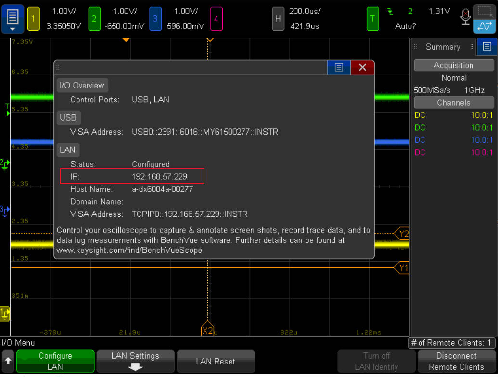

## 配置示波器的IP

以下是将示波器配置为静态IP的方法：

1. 如果你已经能够通过网页访问示波器，那么在网页的"Configure LAN"中即可配置IP。

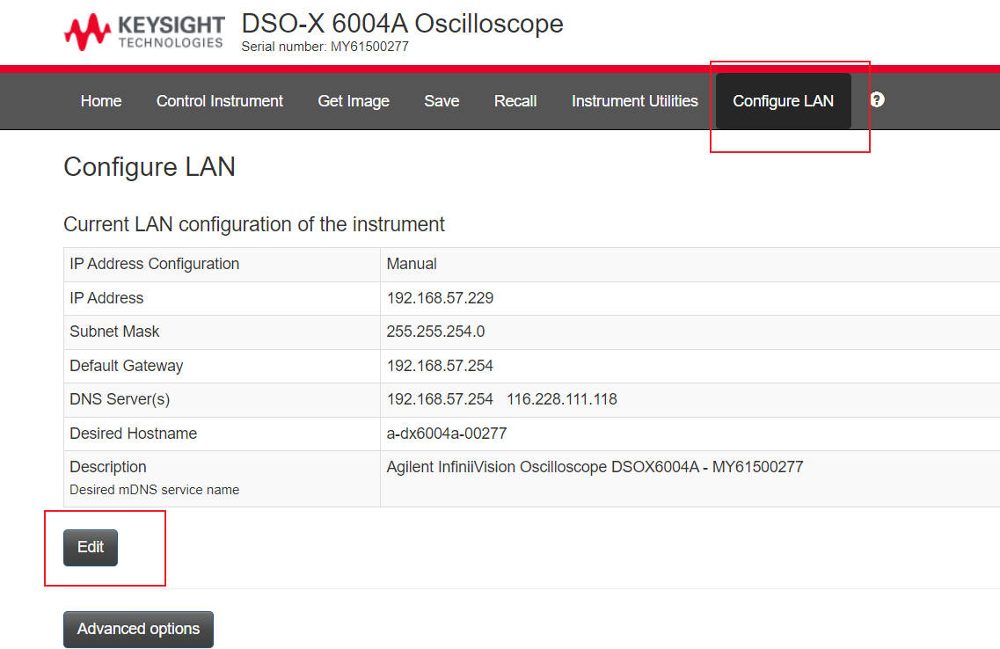
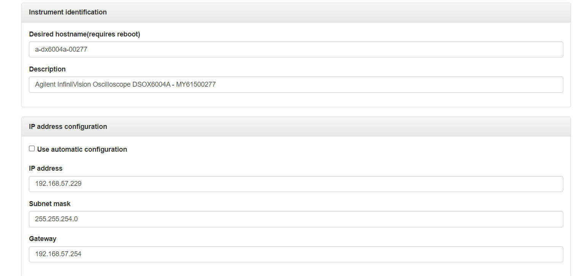

2. 以下是通过示波器配置IP的方法：

  a. 按示波器上的"Utility", 在屏幕上点击"I/O"
  b. 点击"LAN Settings",点击"Config",取消勾选"Automatic"

  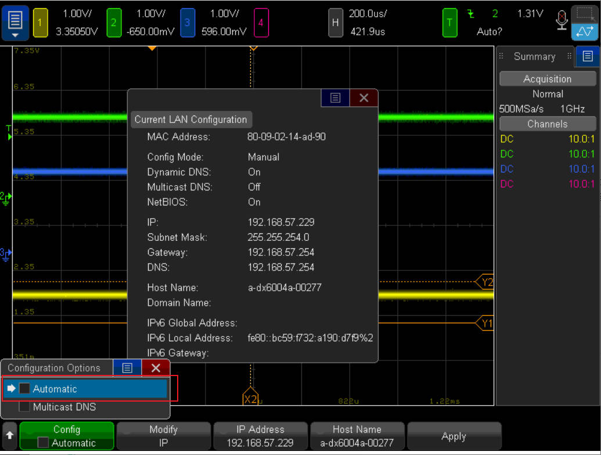

  c. 点击"IP Address"，输入你想要的IP地址

  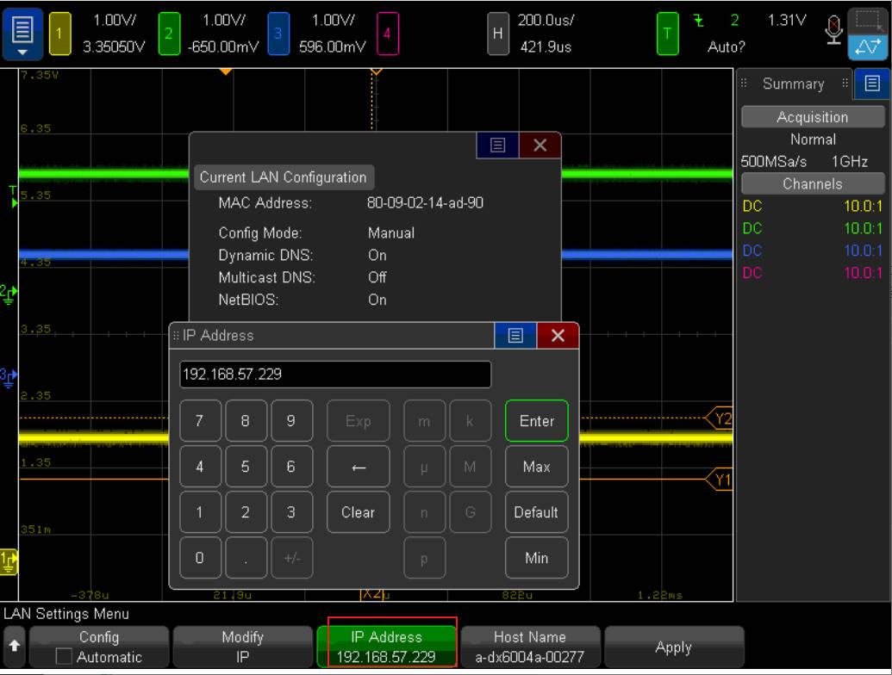

  d. 如果你还想修改DNS，Gateway等，点击如下位置

  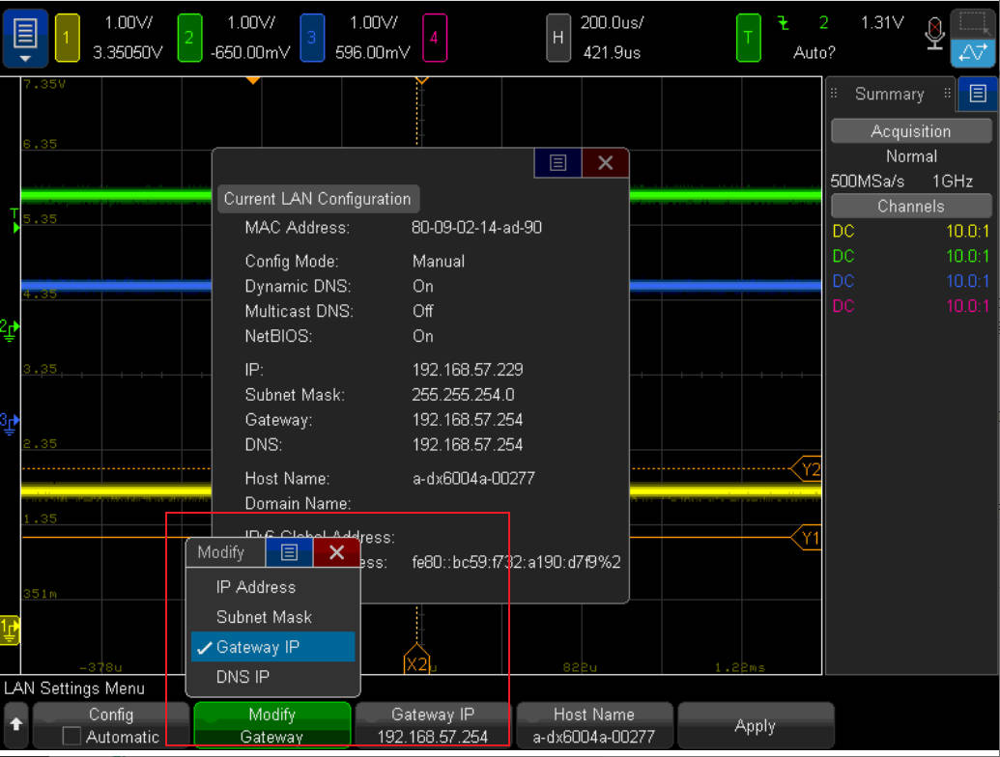

  e. 最后点击"Apply"
