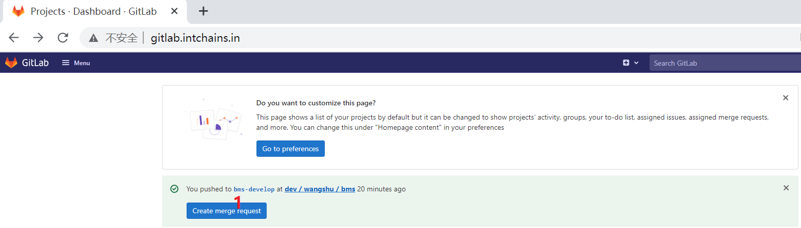
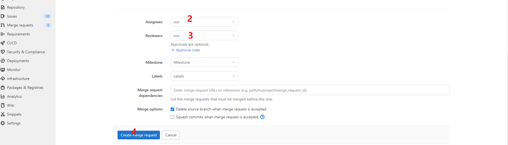
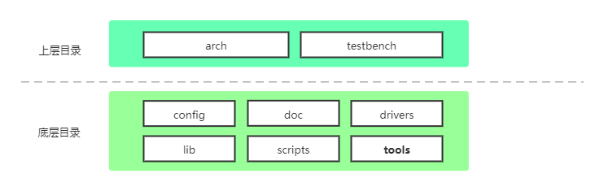
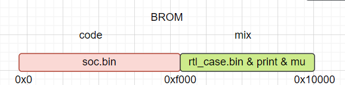
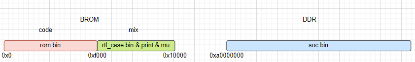

# 关于BMS

## 概述

BMS是BareMetal System的缩写，为Intchains用户WANGSHU芯片验证架构。

## 代码操作

### 代码下载

```shell
git clone ssh://git@gitlab.intchains.in:9002/dev/wangshu/bms.git
```

### 代码编译

```shell
make cskysim_c920_defconfig
make
```

编译成功后，终端输出如下信息，表明soc.elf镜像正常生成。

```shell
  c | lib/stdlib/ctype.c
  c | lib/stdlib/mem.c
  c | lib/stdlib/printf.c
  c | lib/stdlib/putchar.c
  c | lib/stdlib/somalloc.c
  c | lib/stdlib/stdio.c
  c | lib/stdlib/string.c
  c | lib/stdlib/subr_prf.c
  c | testbench/rtlfs/rtlfs-main.c
  c | testbench/skull/skull-main.c
      soc.elf (24K) is ready!
```

### 代码上传

BMS代码由git管理，网页端管理工具是[gitlab](http://gitlab.intchains.in/dev/wangshu/bms)。上传过程分2个步骤：

1. PC端(以ubuntu系统为例)，通过git命令上传代码（bms-develop分支是为了上传合并代码特定建立的）：

```shell
make clean
git checkout -b bms-develop
git add ./
git commit -m "xxxx"
git push --set-upstream origin bms-develop
```

2. gitlab端操作，提出合并代码申请：




按照上图所示，经过操作1，2，3，4等4个步骤，完成合并申请工作。

## 代码框架分析

### 代码目录结构

  
上图代码了BMS的架构实现以及相互调用关系。drivers提供的是针对所有由Intchains生产的CPU的相关驱动，lib提供了基础库和API。arch和Testbench在上层，使用lib和drivers提供的接口完成测试工作。
下面对几个部分做简要的介绍：

### arch

arch目录兼容实现了不同架构CPU的启动代码。

### configs

configs目录保存了不同项目的defconfig文件，方便后续编译。

### doc

doc目录保存了BMS相关的文档，便于查验。

### drivers

Drivers 部分包含每个 Driver 抽象出来的 API，供上层 Testbench 和 arch 调用。

### lib

lib包含了各种芯片相关的基础库，供上层 Testbench 和 arch 调用。

### testbench

testbench 负责 BMS 中涉及到的测试例的实现，测试例涵盖了仿真FPGA验证，RTL验证， EVB验证。

### rom

rom产生rom.bin镜像，负责初始化ddr，为后续验证镜像soc.bin运行创造条件

## 添加新测试例

测试例的添加，以testbench/skull为例，可参考代码

### 添加新文件

在testbench下新建一个skull目录，并新建skull-main.c, Makefile, Kconfig三个文件，内容如下：

```c
/* skull-main.c */
#include <command.h>
#include <common.h>
#include <malloc.h>
#include <testbench.h>

int skull_main(int argc, char *argv[]) {
  printf("hello skull\n");
  return 0;
}

void skull_init(void) { register_testbench("skull", skull_main, NULL); }
testbench_init(skull_init);

```

```Makefile
# Makefile
ARCHIVE := testbench_skull.a

srcs-y += \
  skull-main.c
```

```Makefile
# Kconfig
config TBH_SKULL
  bool "testbench skull support"
  default n
  help:
    enable testbench skull
```

分别修改testbench/Makefile和testbench/Kconfig：

```Makefile
diff --git a/testbench/Kconfig b/testbench/Kconfig
index 08df8ca..5fd4923 100644
--- a/testbench/Kconfig
+++ b/testbench/Kconfig
@@ -2,5 +2,4 @@ source "testbench/cpu/Kconfig"
 source "testbench/dma/Kconfig"
 source "testbench/irq/Kconfig"
 source "testbench/rtlfs/Kconfig"
+source "testbench/skull/Kconfig"
 source "testbench/task/Kconfig"
diff --git a/testbench/Makefile b/testbench/Makefile
index 5f6da30..6fa9d31 100644
--- a/testbench/Makefile
+++ b/testbench/Makefile
@@ -2,6 +2,5 @@ subdirs-$(CONFIG_TBH_CPU) += cpu
 subdirs-$(CONFIG_TBH_DMA) += dma
 subdirs-$(CONFIG_TBH_IRQ) += irq
 subdirs-$(CONFIG_TBH_RTLFS) += rtlfs
+subdirs-$(CONFIG_TBH_SKULL) += skull
 subdirs-$(CONFIG_TBH_TASK) += task
```

修改arch/riscv/c920/cc.mk：

```Makefile
diff --git a/arch/riscv/c920/cc.mk b/arch/riscv/c920/cc.mk
index 5b9a70d..2272ceb 100644
--- a/arch/riscv/c920/cc.mk
+++ b/arch/riscv/c920/cc.mk
@@ -32,7 +32,7 @@ libs-$(CONFIG_TBH_CPU) += testbench_cpu.a
 libs-$(CONFIG_TBH_DMA) += testbench_dma.a
 libs-$(CONFIG_TBH_IRQ) += testbench_irq.a
 libs-$(CONFIG_TBH_RTLFS) += testbench_rtlfs.a
+libs-$(CONFIG_TBH_SKULL) += testbench_skull.a
 libs-$(CONFIG_TBH_TASK) += testbench_task.a
 
 libs-y += arch_$(TARGET).a

```

## 测试例流程分析

### 申明init函数

testbench_init(skull_init)，声明了 skull_init()为该测试例的初始化函数。  
testbench_init()是一个宏，使用该宏声明过的函数，会在BMS运行初始化时被自动调用。因此该宏的使用有着严格的要求：

1. 被声明的函数中(该例中是 skull_init)，绝对禁止寄存器访问等硬件操作
2. 被声明的函数中(该例中是 skull_init)，软件操作也要足够少，一般来说，只会用到register_testbench()

### 注册测试例

register_testbench()可以向系统注册一个测试例，该函数有三个参数，释义如下：

```c
int register_testbench(const char *name, void *cmd_entry, void *rtl_entry);
```

向系统注册一个测试例，该测试例可以被系统识别，并通过命令行调用到。  
参数列表：  
|参数名|参数说明|
|--|--|
|name|测试例的名称，此名称会被系统当作该测试例的命令字，在终端敲入该测试例的 name 后，系统会调用该测试例的 cmd_entry|
|cmd_entry|测试例处理函数|
|rtl_entry|暂时无用|

### 测试例处理

skull_main()为该测试例的处理函数，通过 register_testbench 注册给系统。该函数即为测试例的入口，执行该测试例的具体工作。如果测试例比较简单，可以统统在该函数中搞定。当遇到测试例比较复杂的情形，推荐把代码封装成区分功能的函数，甚至文件，供该 main 函数调用，共同完成测试功能。需要注意的是，做为处理函数(本例为 skull_main)的返回值有明确的含义，见下表:  

```c
int skull_main(int argc, char *argv[]);
```

参数列表:  
|参数名|参数说明|
|--|--|
|argc|命令参数个数|
|argv|命令参数表|
 
|返回值|返回值说明| 
|--|--|
|0|表示测试成功结束。这里的情况一定是程序本身对结果有预期，并且可以自动判断执行结果达到预期。|
|1|表示测试结束，但程序本身无法对结果正确与否做出判断。(比如显示一帧图像)|
|负值|表示测试失败。这里的情况一定是程序本身对结果有预期，并且可以自动判断执行结果没有达到预期。|

## 验证流程分析

### 验证镜像简介

1. rom.bin: 负责初始化ddr，并根据标志位判断是否是RTL测试环境，如是，则跳转到soc.bin

rom.bin编译选项:  

```shell
make menuconfig
```

```shell
                 Target Architecture (risc-v)  --->                                              
                 Machine (c920)  --->                                                            
             [*] support super user (NEW)                                                        
                 Target Mode (cskysim)  --->                                                     
             (4) CPU Max Cores (NEW)                                                             
             [ ] compile rom.bin (NEW)                                                           
             [ ] support cache (NEW)                                                             
             [ ] support mmu (NEW) 
```

2. soc.bin: 负责测试例执行  
3. rtl_case.bin: RTL测试专用，用来在RTL环境下确认执行哪个测试例

### 验证流程简述

#### rom.bin不存在



1. 代码开始前，soc.bin下载到0x0地址(在RTL测试时，需要在0xf400地址处下载rtl_case.bin)
2. soc.bin开始按照测试例的流程测试代码。
   
注：由于BROM memory大小的限制，soc.bin的大小要在[0, 60K]之间。

#### rom.bin存在



1. 代码开始前，rom.bin下载到0x0地址(在RTL测试时，需要在0xf400地址处下载rtl_case.bin), soc.bin下载到0xa0000000
2. rom.bin初始化ddr，并跳转指针到soc.bin位置（0xa0000000），开始执行测试代码

注：由于存在rom.bin，即初始化ddr，且把soc.bin运行在ddr的环境下，因而，对soc.bin镜像大小无限制；但同时，初始化ddr的动作也耗费了大量时间，因而在RTL验证时，需要谨慎使用。

## RTL验证包生成

RTL验证包生成命令(此命令需在bms根目录下运行)如下所示：

```shell
python tools/verify/verify.py rtlcases c920 dma
```

命令构成：  

c920: cpu IP名，当前frigoris项目支持c920或e906  
dma: 需要测试的测试名。此名称需要与doc/verification/下的文件名相同(需省略文件后缀名.md)  

命令结果：

```shell
xxx@ubuntu:~/Desktop/bms$ ls tools/verify/
Frigoris_RTL_dma_20220716.tar.gz  verify.py
xxx@ubuntu:~/Desktop/bms$
```
