# FPGA验证流程说明

## 关于bms

bms是BareMetal System的缩写，为Intchains用户WANGSHU芯片验证架构，其中包含 drivers,testbench,lib等等。本文主要讲述，如何使用S2C(FPGA)，以及如何配置CKLINK PRO，并在S2C平台上，使用CKLINK PRO调试bms代码。关于bms的详细描述，需要参考文档bms_note_v1.0.md。

## 初步准备

### 使用S2C平台

S2C平台，是通过一台公共电脑远程操控的。操作步骤如下所示：  

1. 使用向日葵远程登录公共控制电脑  
   
 

2. 输入伙伴识别码：534479114，验证码：e9BH4v
3. 双击桌面上的控制S2C平台的软件PlayerPro_Runtime  

  

4. 点击读取S2C平台当前状态的按钮，查看S2C状态  

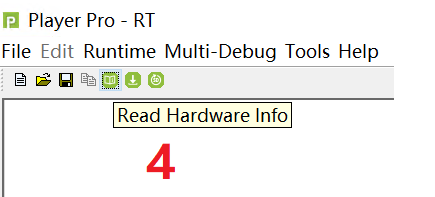  

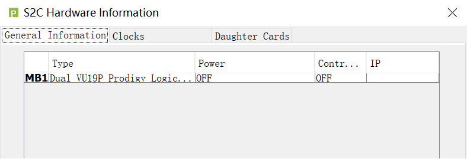  

5. 如果S2C平台当前状态为OFF，按照步骤给S2C平台上电，否则直接执行步骤7  
   a) 点击Runtime->Power Management->Power Control  
   b) 选择Power ON  
   c) 点击apply上电  

.png)  

.png)  

6. 点击读取S2C平台当前状态的按钮，查看S2C状态，以保证S2C Power状态为ON  
   
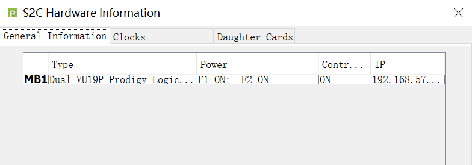  

7. 按照步骤，选择需要下载的镜像文件(镜像文件在桌面bitfile文件夹下，并以.bit为后缀的文件)，并下载FPGA镜像文件，然后等待FPGA镜像下载完成。  
   a) 点击下载按钮  
   b) 选择需要下载的FPGA镜像文件(注：下载FPGA.F1还是FPGA.F2取决与你T-Head DebugServer板块中描述的你登录的那个控制账号，详情请见下一章节)   
   c) 点击download

.png)  

.png)

注：使用完成后，需要关闭S2C电源，具体流程与上电过程相似，只是在：  
   a) 点击Runtime->Power Management->Power Control  
   b) 选择Power Off  
   c) 点击apply 

### 使用T-Head DebugServer

T-Head DebugServer是T-head官方提供的，用JTAG接口，连接FPGA硬件平台的软件，其最主要的作用是启动GDB Server，为eclipse远程连接调试S2C FPGA硬件平台提供服务。

#### 登录T-Head DebugServer控制账号

1. 使用windows自带的远程桌面连接软件，配置IP(目前FPGA支持2个用户同时使用，因为IP分为192.168.57.208(指代FPGA平台的F1)和192.168.57.209(指代FPGA平台的F2))，并点击连接  
    
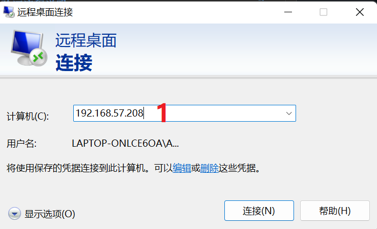 
 
2. 如果你登录的IP是192.168.57.208，则对应用户名fpgatest0，密码：intFPGA;反之，登录的IP是192.168.57.209，则对应用户名fpgatest1，密码：intFPGA

#### 使用T-Head DebugServer说明

1. 双击桌面上的T-Head DebugServer  
   
  

2. 选中T-Head DebugServer配置文件  
   a) 点击打开配置文件图标(load config file)  
   b) 选中桌面上的默认配置文件，default.ini  
   c) 点击打开  

.png) 

3. 点击连接(Run debugger server)图标  

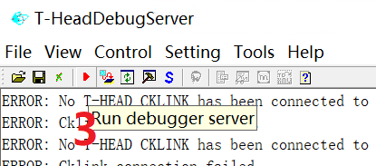  

4. 看到此图表示连接成功  

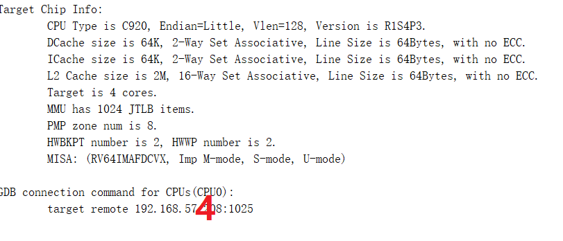  

### Eclipse安装及使用

Eclipse是一个功能强大的IDE平台，提供了性能优越的JTAG调试工具。

#### Eclipse安装

1. 在nas网盘(https://nas.intchains.in:8999/)->共享目录_全公司->研究院软件目录下,下载Eclipse ubuntu版安装软件eclipse-inst-jre-linux64.tar.gz
2. 解压安装包，并执行安装命令
   
``` shell
tar -xvf eclipse-inst-jre-linux64.tar.gz 
sudo ./eclipse-inst
```

3. 点击Eclipse IDE for Embedded C/C++ Developers  
   
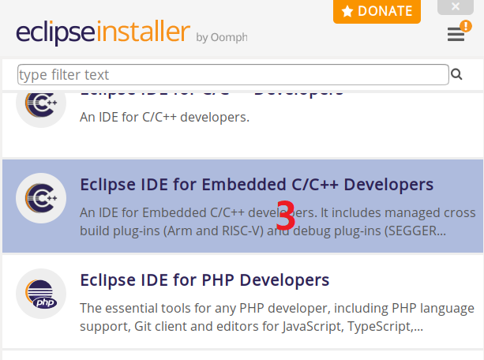  

4. 点击INSTALL按钮

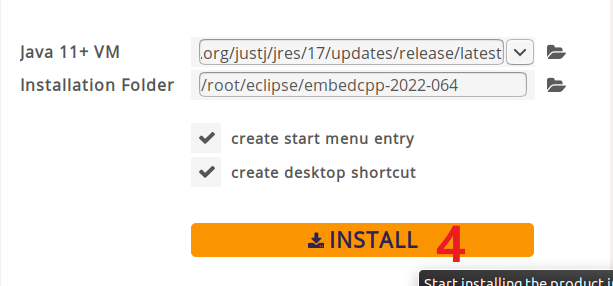  

#### Eclipse配置

1. 点击Run->Debug Configurations...，打开配置Debug配置界面  
   
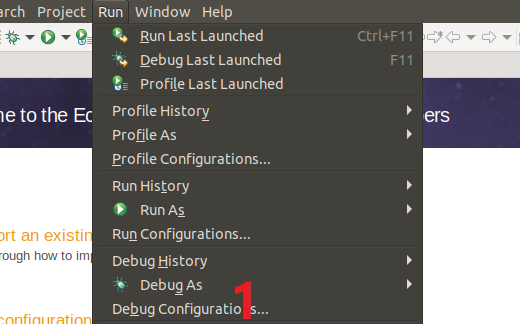  

2. 双击GDB Hardware Debugger
3. 在Name中填写c920_soc_connect
4. 在C/C++ Application中，填写镜像路径：/home/sun/software/bms/out/soc.elf(按照实际情况填写)
5. 选择Disable auto build
6. 点击Apply  
   
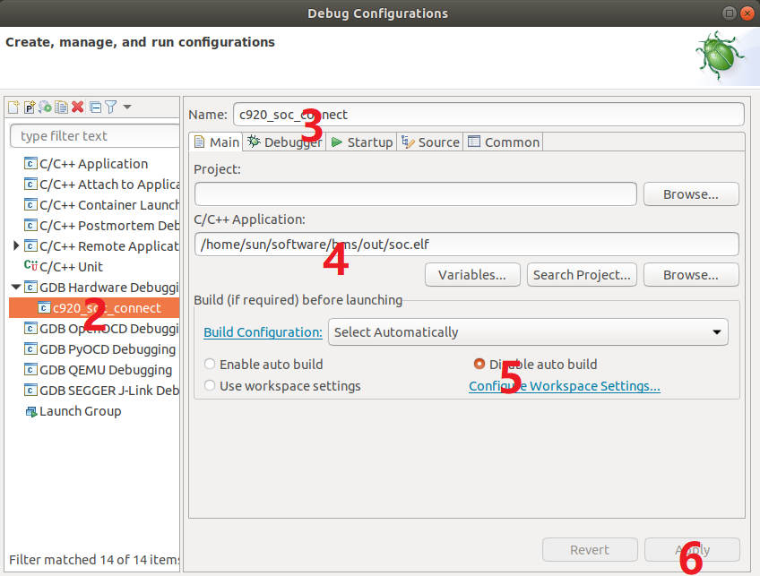  

7. 点击Debugger标签，在GDB Command栏中，填写GDB路径：/opt/toolchain/t-head-rv64/bin/riscv64-unknown-linux-gnu-gdb(按照实际情况填写)
8. 在Connection栏填写GDB IP及端口： 192.168.57.208：1025(按照实际情况填写)
9. 点击Apply

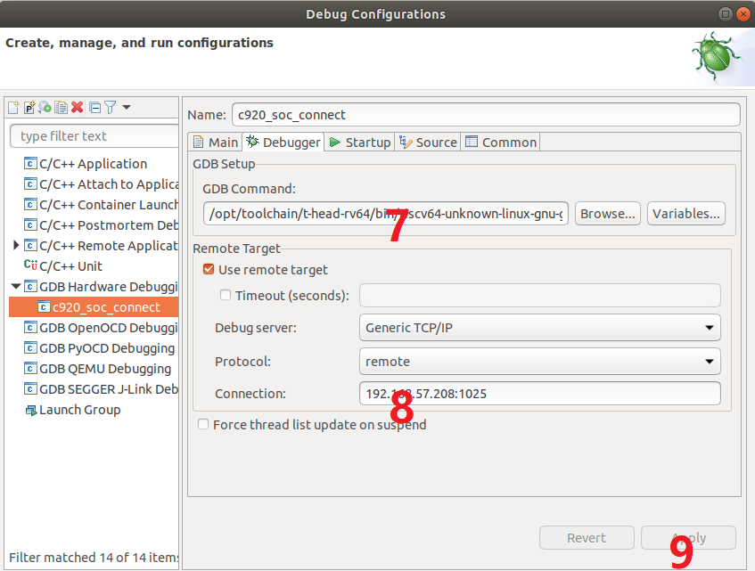  

10. 点击Startup标签，在Image offset(hex)栏填写：140000000
11. 在Symbols offset(hex)栏填写：400000000
12. 打勾Set program counter at(hex)，并在此栏填写14000000

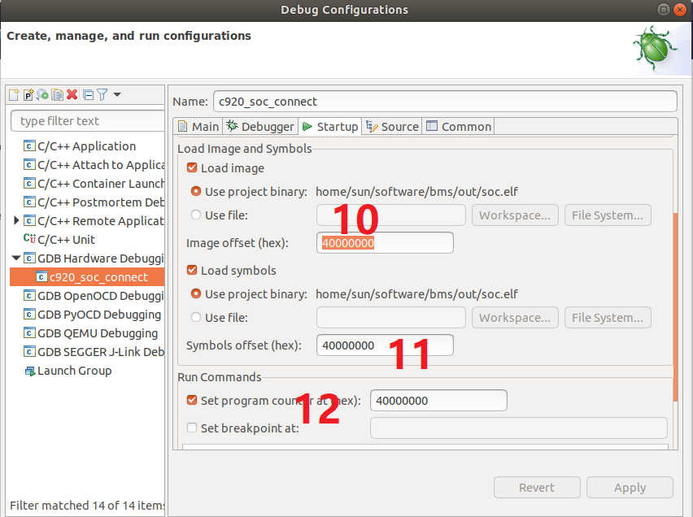  

13. 点击Source标签，点击Add->File System Directory,填写bms路径：/home/sun/software/bms(按照实际情况填写)

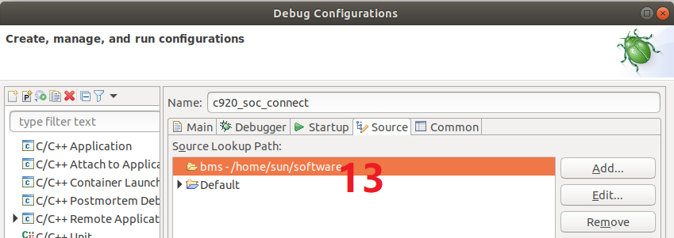  

14. 点击Debug，尝试与T-Head DebugServer软件起的server相连
15. 点击Switch，切换到Debug模式  

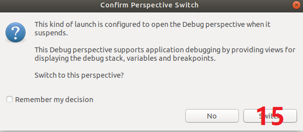  

16. 点击Restore，切换Debug界面  

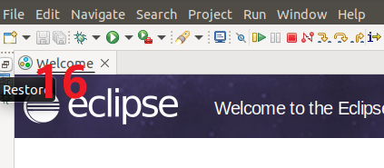  

17. 点击Resume图标，运行bms代码  

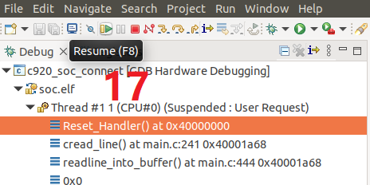 

注： 为调试方便，可点击Window->Show View->Disassembly，Memory Browser等界面，来辅助调试。

### 使用sscom

sscom是windows版本的串口工具。

1. 双击桌面的软件图标sscom5.13.1  

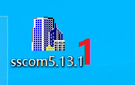  

2. 按照图示设置，其中端口号按照实际情况设置  
   
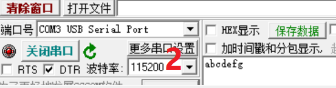 

3. 在Eclipse第17步前，使用sscom，然后执行第17步，将会看到如下图所示界面  

 
