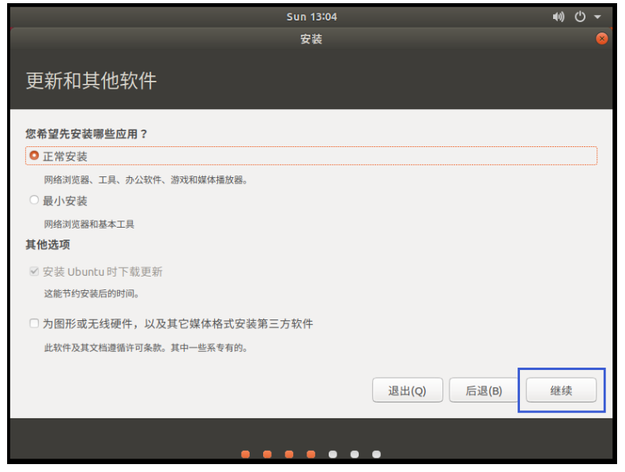
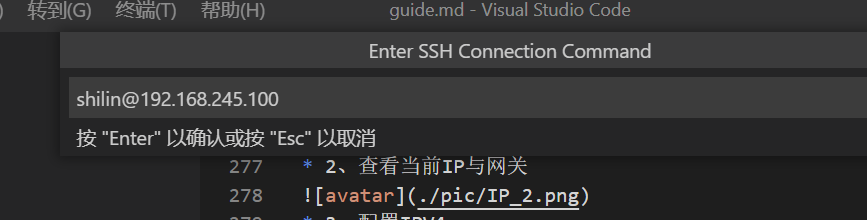

# 新员工指南

## 安装公司邮箱

1. 向hr申请， alex.shen@inchains.com  （根据个人可以设置，公司内唯一）
2. 官网下载foxmail
3. 选择右上角设置菜单里面的账号管理 选择新建腾讯企业邮箱 点击手动设置

 
 
自己申请的账号和密码，初始密码Int12345

 
 
 5，配置成功
 
 

## 申请GITLAB

  GitLab是一个基于Git实现的在线代码仓库软件，你可以用GitLab自己搭建一个类似于GitHub一样的仓库，但是GitLab有完善的管理界面和权限控制，一般用于在企业、学校等内部网络搭建Git私服，我们使用Gitlab进行公司的代码的管理。

  向自己主管申请GITLAB权限，顾腾负责开通 通常gitlab的用户名和密码 和邮箱用户名一致
  gitlab的地址：<http://gitlab.intchains.in:9000/>

## WIN10下安装vmware 安装ubuntu18.04编译环境
公司网盘访问地址   <https://nas.intchains.in:8999/>
研究院软件目录下下载
  


### 安装VMware workstation

 VMware-workstation-full-14.1.2-8497320   SN:CG54H-D8D0H-H8DHY-C6X7X-N2KG6

* 点击创建新虚机</br>

   
* 选择自定义(高级)

   
* 默认下一步

   
* 选择稍后安装操作系统

   
* 选择LINUX UBUNTU64位

   
* 根据自己的情况 推荐建立这样的目录结构

   
* 选择处理器数量和内核数量分别是

   
* 设置虚拟机内存

   

* 设置网络类型为不使用网络链接


* 设置I/0控制器类型默认


* 选择磁盘类型为默认


* 选择创建新虚拟磁盘


* 设定磁盘大小为50G且将磁盘存储为单个文件


* VMware 会根据你前面命名的虚拟机名称，生成一个磁盘文件名称，默认“下一步”，然后检查前面设置的信息，有问题的可以点击“上一步”去更改，没有问题点击“自定义硬件”


* 弹出硬件设置框，选择“新CD/DVD(SATA)”这一项，然后在右边选择“使用ISO映像文件”，然后选择我们前面下载的Ubuntu 18.04 镜像文件的路径，完成后点击“关闭”，回到上个页面点击“完成”，这样向导设置就完成了（这步的作用就是在虚拟安装ubuntu镜像文件了）


* 虚拟机已经配置完毕，接下来我们开启刚才创建的虚拟机，选择相应的虚拟机名称，然后点击“开启此虚拟机”


* 正常情况下会来到如下页面，选择“EN”，然后点击“安装Ubuntu”即可（注意：要将输入定向到虚拟机，在虚拟机内部单击或按Ctrl+G；要返回到你的计算机，将鼠标指针从虚拟机中移出或按Ctrl+Alt。另外，界面底部提醒我们安装VMware Tools，此时可不必理会或“以后提醒我”，以免扰乱我们正常的安装进程！


* 选择正常安装



* 选择清除整个磁盘并安装


* 弹出确认框并继续


* 城市可以默认也可以输入SHANGHAI


* 设置用户名密码 用于登录ubuntu系统


* 安装完毕后重 用设置的用户名和密码登录 展现ubuntu界面


### 配置VMwaretools实现window10与ubuntu文件共享

* 在本地盘符下创建共享目录 比如C:\sharecode
* 启动虚机 点击虚拟机-》设置菜单 点击设置 配置共享文件


* 安装Vmwaretools


* 如果弹出如下对话框，点击是


* 会发现虚拟机设备下多了VMware Tools这一项，点击它，其里面有一个VMwareTools…tar.gz文件


* 接着创建一个目录（全程root用户模式下）用来等会挂载CD

* 把压缩包copy到/tmp下解压

 ```shell
  sudo cp VMwareTools-10.2.5-8068393.tar.gz /tmp
  cd /tmp
  sudo tar zxvf VMwareTools-10.2.5-8068393.tar.gz
 ```

 ```shell  
  cd vmware-tools-distrib
  sudo ./vmware-install.pl 
 ```

执行脚本，然后根据屏幕提示一路回车。

看到enjoy就是成功了

* 在window的共享文件夹下放入一些文件

  ```shell
  cd /mnt/hgfs  
  ls 
  ```

如果可以查看到放入的文件 表明window和ubuntu共享文件夹生效了可以实现文件共享

## 配置git

* 需要安装git 输入

 ```shell
sudo apt-get install git
sudo apt-get update -y
 ```

* 生成rsa

 ```shell
cd ~/.ssh
ssh -keygen -t rsa 
.ssh# ls
id_rsa  id_rsa.pub  known_hosts
root@alex-virtual-machine:~/.ssh# cat id_rsa.pub
ssh-rsa AAAAB3NzaC1yc2EAAAADAQABAAABAQDICDQsksbyxWauuLn+dQ6C9DfGFaVhbG4Gju5m/YsqRhFtrN4WLcD4QtxO2UPrYsxNiaM7M8Obq0mYDSoTH+scNej4aPMsxLrxgk8QbRGf7cn6lqQVaF+sAIxvexgM0PltlD2KYJZOKbp+K6xA4DbKKXOtAtOU3shXNZcd4Qw0kXGuH7ansIK5/Xa5Okh0eWCyqPiSw4CO5CfP93X4kP/9O3YV8+AhaBOWgBgfV0J6yQASU6XufQTWhfia2xy0vZDqpZ1Nc3uuKpkGD86bDWLtxsCV21g0X64R2LvyKLS1/RlaF2F60JWkD2dshK30ye1fafPj9XpoXZ2+Q3CtNsLX alexshen
root@alex-virtual-machine:~/.ssh#
 ```

把rsa.pub里面的秘钥加入gitlab的 SSH Keys

  


## 下载代码编译

* 在ubuntu下建立代码下载目录 比如 /home/code

* 进入目录下载代码

  ```shell
  cd  /home/code
  git clone ssh://git@gitlab.intchains.in:9002/dev/wangshu/bms.git
   ```

* 从钉钉云盘->研究院软件 目录下载编译包 Xuantie-900-gcc-elf-newlib-x86_64-V2.6.1-20220906.tar.gz
* 也可以从[t-head官网](https://occ.t-head.cn/community/download)下载，位于"工具-工具链-900系列"

* 建立目录解压压缩包

  ```shell
  sudo mkdir -p /opt/toolchain/t-head-rv64
  sudo tar zxvf Xuantie-900-gcc-elf-newlib-x86_64-V2.6.1-20220906.tar.gz --strip-components 1 -C /opt/toolchain/t-head-rv64
   ```

* 安装make包

```shell
 sudo apt install make
 ```

* 安装gcc包

```shell
 sudo apt install gcc
 sudo apt install g++
```

* 编译

```shell
 cd /home/liu/src/debug/bms
 make cskysim_c920_defconfig
 make
```

```log

liu@ubuntu:~/src/debug/bms$ make cskysim_c920_defconfig
#
# configuration written to /home/liu/src/debug/bms/out/.config
#
liu@ubuntu:~/src/debug/bms$

liu@ubuntu:~/src/debug/bms$ make
  c | arch/riscv/c920/main.c
  c | lib/command/cmd_skeleton.c
      soc linkerfile updated!
      soc.elf (44K) is ready!
liu@ubuntu:~/src/debug/bms$
```

## 使用qemu模拟器验证

* 从钉钉云盘->研究院软件 目录下载qemu运行包
xuantie-qemu-x86_64-Ubuntu-18.04-20220402-0353.tar.gz
* 通过共享文件夹复制到ubuntu系统解压/home/tools目录
* 阅读XuanTie_QEMU_User_Guide.PDF文档
* 执行

``` shell
cd /home/tools/bin 
export PATH=$PATH:/home/tools/bin
cskysim -soc /home/liu/src/debug/bms/tools/cskysim/c920_cfg.xml -kernel /home/liu/src/debug/bms/out/soc.elf -nographic
```

``` shell
liu@ubuntu:~/src/debug/bms$ cskysim -soc /home/liu/src/debug/bms/tools/cskysim/c920_cfg.xml -kernel /home/liu/src/debug/bms/out/soc.elf -nographic
QEMU cmdline: qemu-system-riscv64 -soc shm=on,shmkey=713 -kernel /home/liu/src/debug/bms/out/soc.elf -nographic -machine dummyh -cpu c920


WSS: commit 82e7e88a9a8996e9242e81bc5f6180d13b520ba9
WSS: liu@ubuntu, 09/25/22 20:30:12

testbench: initialized buffer for 170 benches
hash: add new module crc32
testbench: registered for cpu
testbench: registered for rtlfs
testbench: registered for skull


tb:/$
```

说明：这个指令的路径是根据个人不同可能有差异 核心是调用c920_cfg.xml 和 soc.elf 可能因为型号不同文件名不同

## 使用VSCode 远程编辑代码

* 安装ssh服务  
``` shell
sudo apt-get install openssh-server
```
* 设置Ubuntu使用静态IP  

* 1、打开系统设置  
  

* 2、查看当前IP与网关  
  
* 3、配置IPV4  
  

* 从钉钉云盘->研究院软件 目录下载VSCodeSetup-x64-1.57.1.exe  VSCode安装包并完成安装  

* 在扩展插件中下载Remote - SSH  
  

* 文件->首选项->设置->Show Login Terminal 打上勾  
  
  

* 点击+号添加创建SSH配置  
  

* 填写远程目标主机账号名和IP地址（之前设置的静态IP）后，按Enter回车键  
  
  

* 选择目标主机类型>Linux  

* 开始SSH访问远程主机  
  

* 输入登录用户密码  
  

* 登录成功后可以看到远程端代码  
  


## 一些依赖包缺失的处理方法

在编译和模拟器使用过程中可能存在提示缺失依赖包的情况
通过安装解决

``` shell
sudo apt-get update
sudo apt-get install apt-file
sudo apt-file update
sudo apt-get install libsnappy-dev
sudo apt-get install libdaxctl-dev
sudo apt-get install libvdeplug-dev
sudo apt-get install libpmem-dev
sudo apt-get install libaio-dev
```
