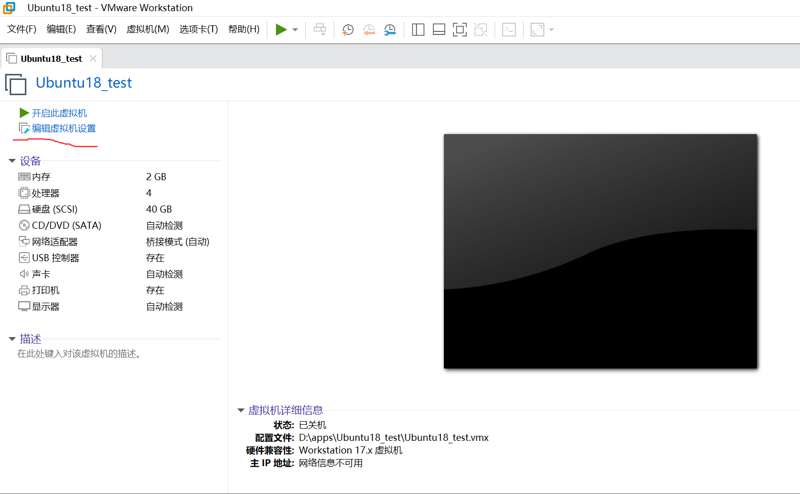
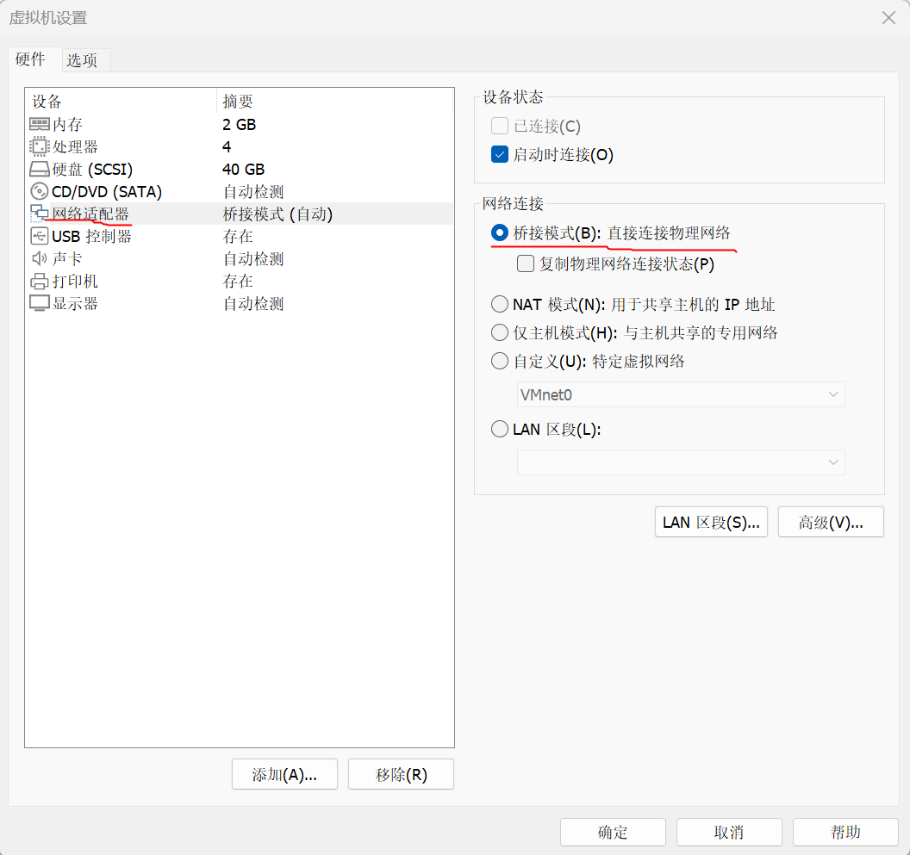
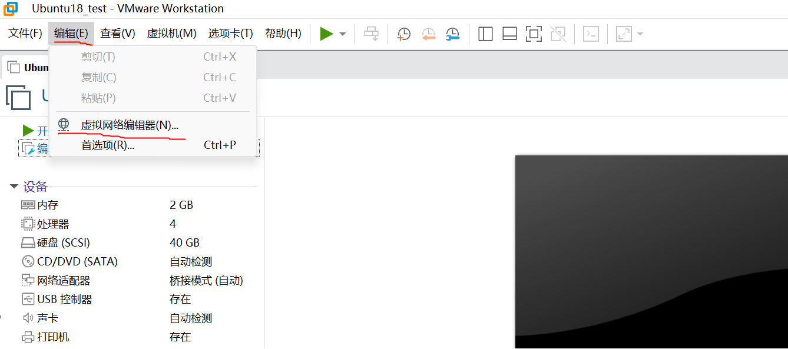
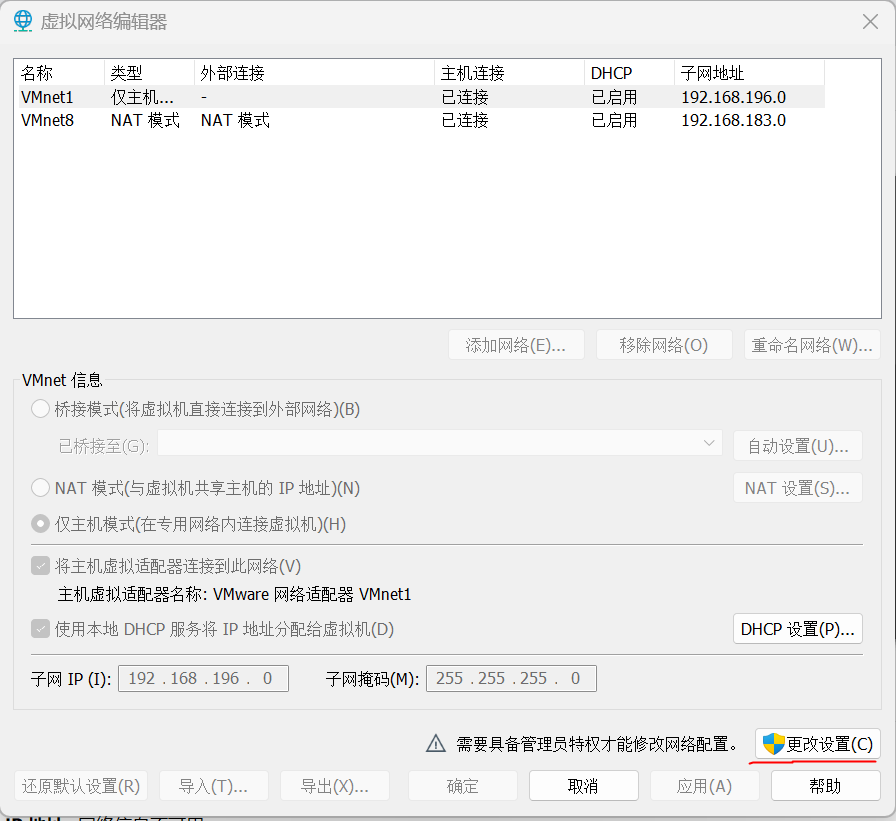
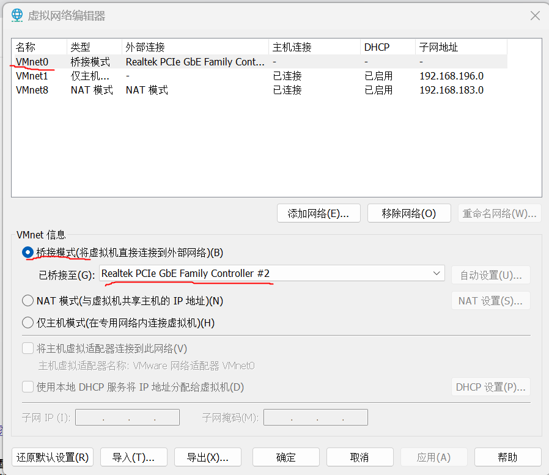

# fpga与pc通信测试环境搭建

## 1. 物理接线方式

将fpga端与pc端通过网线直连

## 2. pc端

测试时使用的软件版本为vmware17，ubuntu18.04，并关闭windows系统防火墙。所有操作均在虚拟机关机状态下进行。按照以下图片中画红线的部分完成设置，目的即是使用桥接网络，将虚拟机桥接到网线对应的物理网卡。

然后打开ubuntu虚拟机，使用ifconfig命令确定网卡名称为ens33，然后切换到eth_tx_rx_test可执行文件所在目录，执行命令sudo gcc eth_tx_rx_test.c -o eth_tx_rx_test编译，sudo ./eth_tx_rx_test ens33 null运行。eth_tx_rx_test只接收目的mac地址为ff:ff:ff:ff:ff:ff、源mac地址为64:00:01:02:03:04的以太网帧。

## 3. fpga端

fpga端下好bit文件后运行bms，执行命令eth -in 0，等待测试通过。注：由于在fpga平台pin管脚信号质量不好，测试过程中数据不能发送太快，需延时一定时间后再发送下一次，否则pc端可能会收不到数据或接收数据内容部分出错。

## 4. phy wol功能

pc端执行命令sudo ./eth_tx_rx_test ens33 magic发送包含magic packet的以太网帧：dst mac + src mac + len + ff:ff:ff:ff:ff:ff + dst mac 16 repetition。除帧校验部分，共116字节。
