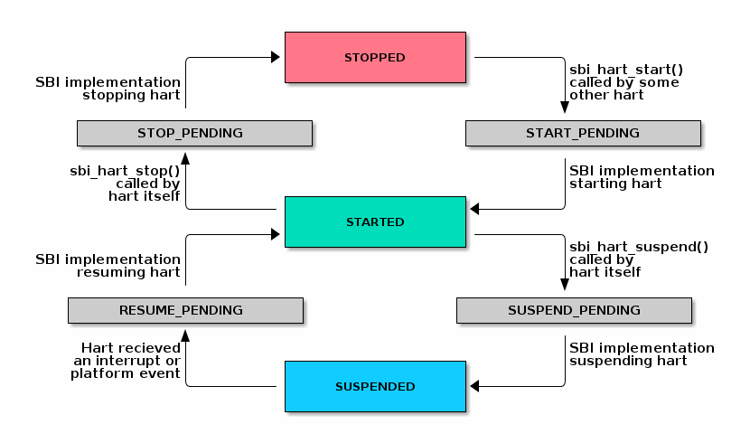
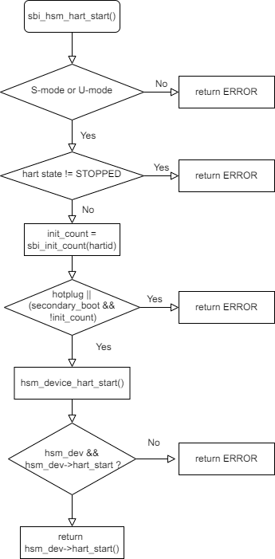
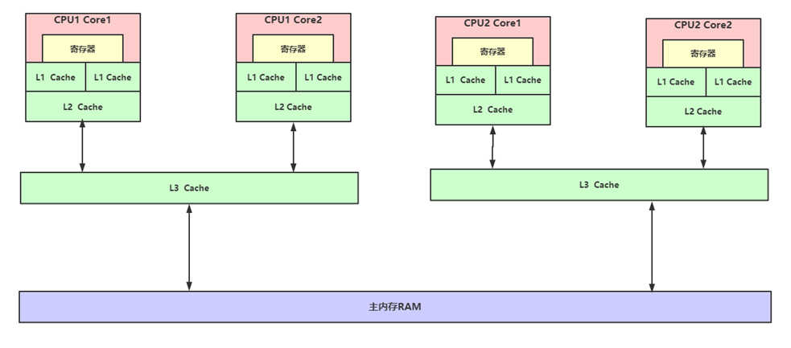
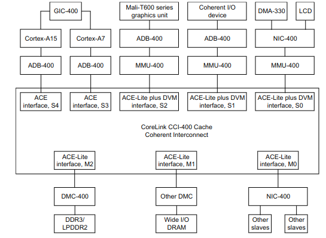
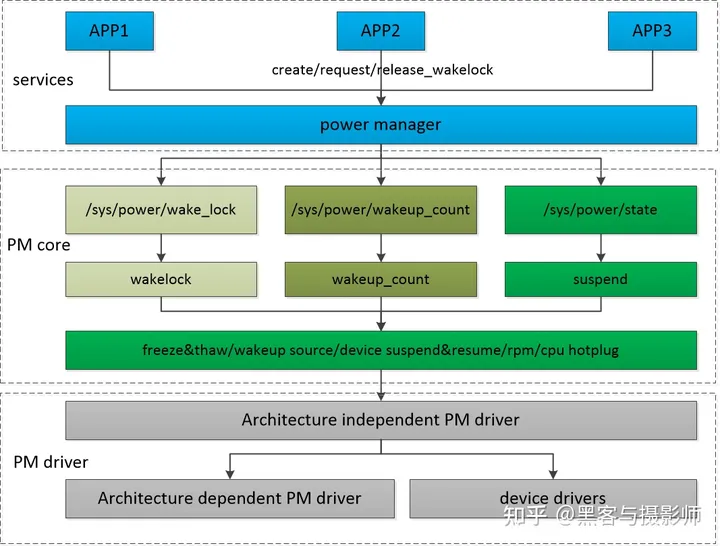
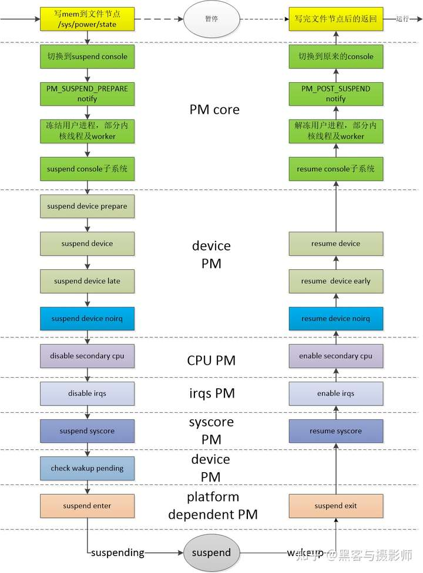
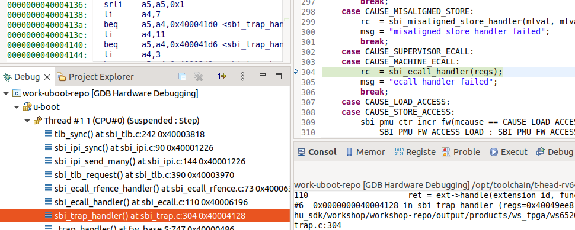

## 一、riscv架构下多核启动

参考文档：https://tinylab.org/opensbi-firmware-and-sbi-hsm/

对照 linux 6.6 和 opensbi 1.0

opensbi 提供了 HSM扩展 来管理 hart状态。

HSM，Hart State Management Extension，硬件线程hart状态管理扩展，它引入了一组hart状态和一组S模式软件用于获取和改变hart状态的函数。

| 状态 ID |     状态名      | 描述                                                         |
| :-----: | :-------------: | :----------------------------------------------------------- |
|    0    |     STARTED     | hart 被物理启动且正常运行                                    |
|    1    |     STOPPED     | hart 没有在 S 模式或任何更低的特权模式下执行。如果平台有能够关闭 hart 的机制，这可能是因为它被 SBI 的实例关闭了 |
|    2    |  START_PENDING  | 其它 hart 要求从 **STOPPED** 状态继续或启动这个 hart，SBI 实例正在尝试让该 hart 进入 **STARTED** 状态 |
|    3    |  STOP_PENDING   | 该 hart 要求将自己从 **STARTED** 状态停止或关闭，SBI 实例正在尝试让该 hart 进入 **STOPPED** 状态 |
|    4    |    SUSPENDED    | 该 hart 处于平台特定的挂起（或低功耗）状态                   |
|    5    | SUSPEND_PENDING | 该 hart 要求让自己从 **STARTED** 状态进入平台特定的低功耗状态，SBI 实例正在尝试让其进入平台特定的 **SUSPENDED** 状态 |
|    6    | RESUME_PENDING  | 中断或平台特定的硬件事件导致 hart 从 **SUSPENDED** 状态转为正常执行，SBI 实例正在尝试将该 hart 转为 **STARTED** 状态 |

任何时刻 hart的状态只可能是上表中的某一种，SBI实现的hart状态转移需要遵循以下状态机：



### 1.1 SBI HSM 函数

smode下的软件通过 sbi_ecall 来调用到 opensbi

```c
/* linux：arch/riscv/kernel/cpu_ops_sbi.c */
static int sbi_hsm_hart_start(unsigned long hartid, unsigned long saddr,
			      unsigned long priv)
{
	struct sbiret ret;
	ret = sbi_ecall(SBI_EXT_HSM, SBI_EXT_HSM_HART_START,
			hartid, saddr, priv, 0, 0, 0);
}

#ifdef CONFIG_HOTPLUG_CPU
static int sbi_hsm_hart_stop(void)
{
	struct sbiret ret;
	ret = sbi_ecall(SBI_EXT_HSM, SBI_EXT_HSM_HART_STOP, 0, 0, 0, 0, 0, 0);
}

static int sbi_hsm_hart_get_status(unsigned long hartid)
{
	struct sbiret ret;
	ret = sbi_ecall(SBI_EXT_HSM, SBI_EXT_HSM_HART_STATUS,
			hartid, 0, 0, 0, 0, 0);
}
#endif

/*==============================================================*/
/* opensbi: lib/sbi/sbi_ecall_hsm.c */
static int sbi_ecall_hsm_handler(unsigned long extid, unsigned long funcid,
				 const struct sbi_trap_regs *regs,
				 unsigned long *out_val,
				 struct sbi_trap_info *out_trap)
{
   	switch (funcid) {
	case SBI_EXT_HSM_HART_START:
		ret = sbi_hsm_hart_start(scratch, sbi_domain_thishart_ptr(),
					 regs->a0, regs->a1, smode, regs->a2);
		break;
	case SBI_EXT_HSM_HART_STOP:
		ret = sbi_hsm_hart_stop(scratch, true);
		break;
	case SBI_EXT_HSM_HART_GET_STATUS:
		ret = sbi_hsm_hart_get_state(sbi_domain_thishart_ptr(),
					     regs->a0);
		break;
    }
}
```

### 1.2 应用层操作接口

```shell
# 查看cpu info， processor 表示打开的cpu id
cat /proc/cpuinfo

# 关闭/打开 cpu core， 其中 X 表示 cpu id
echo 0 > /sys/devices/system/cpu/cpuX/online
echo 1 > /sys/devices/system/cpu/cpuX/online

# 绑定进程到cpu --- taskset
# 查看绑定情况
taskset -p pid
# 启动程序并绑定
taskset -c core1,core2 func &
# 启动程序后绑定
taskset -cp core1,core2 pid
taskset -cp core1,core2-core5 pid
taskset -p core_mask pid

# 绑定中断到cpu
echo core_mask > /proc/irq/irqn/smp_affinity  
```

### 1.3 opensbi hsm 控制实现




```c
if ((hsm_device_has_hart_hotplug() && (entry_count == init_count)) ||
   (hsm_device_has_hart_secondary_boot() && !init_count)) {
    rc = hsm_device_hart_start(hartid, scratch->warmboot_addr);
} else {
    rc = sbi_ipi_raw_send(sbi_hartid_to_hartindex(hartid));
}
```

opensbi 最终通过 hsm dev 或 ipi 中断来控制 hart 状态，

hsm dev模式通过特定的硬件接口来管理cpu core 的状态，通常依赖于硬件提供的状态管理寄存器和机制，这种模式下 cpu 管理相对独立，不依赖于其他cpu core的协助。

ipi，inter-processor interrupts 内部处理器中断模式通过发送中断信号来管理cpu core状态，通常用于多核系统中，依赖cpu core之间的通信和协作。

### 1.4 opensbi hsm dev 注册实现

参考 platform/generic/andes/ae350.c

本质是调用接口 void sbi_hsm_set_device(const struct sbi_hsm_device *dev) 注册一个hsm dev

```c
struct sbi_hsm_device {
	/** Name of the hart state managment device */
	char name[32];
	int (*hart_start)(u32 hartid, ulong saddr);
	int (*hart_stop)(void);
	int (*hart_suspend)(u32 suspend_type);
	void (*hart_resume)(void);
};
```

## 二、多核启动流程分析

### 2.1 start second cpu

内核在初始化阶段会为每个cpu创建一个idle线程，作为cpu启动时的起始地址。

```c
/* linux:tools/perf/builtin-sched.c */
/* Track idle stats per cpu by maintaining a local thread
 * struct for the idle task on each cpu.
 */
static int init_idle_threads(int ncpu)
{
	int i, ret;

	idle_threads = zalloc(ncpu * sizeof(struct thread *));
	if (!idle_threads)
		return -ENOMEM;

	idle_max_cpu = ncpu;

	/* allocate the actual thread struct if needed */
	for (i = 0; i < ncpu; ++i) {
		idle_threads[i] = thread__new(0, 0);
		if (idle_threads[i] == NULL)
			return -ENOMEM;

		ret = init_idle_thread(idle_threads[i]);
		if (ret < 0)
			return ret;
	}

	return 0;
}

/* linux: kernel/sched/idle.c */
void cpu_startup_entry(enum cpuhp_state state)
{
	current->flags |= PF_IDLE;
	arch_cpu_idle_prepare();
	cpuhp_online_idle(state);
	while (1)
		do_idle();
}
```

内核调用 bringup_cpu 去启动cpu

```c
/*linux: kernel/cpu.c */
static int bringup_cpu(unsigned int cpu)
{
	struct cpuhp_cpu_state *st = per_cpu_ptr(&cpuhp_state, cpu);
	struct task_struct *idle = idle_thread_get(cpu);
	int ret;
    
	ret = __cpu_up(cpu, idle);
	if (ret)
		goto out_unlock;
}
/*linux: arch/riscv/kernel/smpboot.c */
int __cpu_up(unsigned int cpu, struct task_struct *tidle)
{
	int ret = 0;
	tidle->thread_info.cpu = cpu;

	ret = start_secondary_cpu(cpu, tidle);
}

static int start_secondary_cpu(int cpu, struct task_struct *tidle)
{
	if (cpu_ops[cpu]->cpu_start)
		return cpu_ops[cpu]->cpu_start(cpu, tidle);

	return -EOPNOTSUPP;
}
```

cpu_ops会选择使用cpu_ops_Sbi 或 cpu_ops_spinwait

```c
/* linux: arch/riscv/kernel/cpu_ops.c */
void __init cpu_set_ops(int cpuid)
{
#if IS_ENABLED(CONFIG_RISCV_SBI)
	if (sbi_probe_extension(SBI_EXT_HSM)) {
		if (!cpuid)
			pr_info("SBI HSM extension detected\n");
		cpu_ops[cpuid] = &cpu_ops_sbi;
	} else
#endif
		cpu_ops[cpuid] = &cpu_ops_spinwait;
}
```

使用 riscv hsm功能时，使用 cpu_ops_sbi 操作集，这些操作集合会调用sbi_ecall 进入opensbi代码中进行开关内核。

```c
/*linux: arch/riscv/kernel/cpu_ops_sbi.c */
const struct cpu_operations cpu_ops_sbi = {
	.name		= "sbi",
	.cpu_prepare	= sbi_cpu_prepare,
	.cpu_start	= sbi_cpu_start,
#ifdef CONFIG_HOTPLUG_CPU
	.cpu_disable	= sbi_cpu_disable,
	.cpu_stop	= sbi_cpu_stop,
	.cpu_is_stopped	= sbi_cpu_is_stopped,
#endif
};

/* linux：arch/riscv/kernel/cpu_ops_sbi.c */
static int sbi_cpu_start(unsigned int cpuid, struct task_struct *tidle)
{
    unsigned long boot_addr = __pa_symbol(secondary_start_sbi);
    unsigned long hartid = cpuid_to_hartid_map(cpuid);
    unsigned long hsm_data;
    struct sbi_hart_boot_data *bdata = &per_cpu(boot_data, cpuid);
 
    /* Make sure tidle is updated */
    smp_mb();
    bdata->task_ptr = (ulong)tidle;
    bdata->stack_ptr = (ulong)task_stack_page(tidle) + THREAD_SIZE;
    /* Make sure boot data is updated */
    smp_mb();
    hsm_data = __pa(bdata);
    return sbi_hsm_hart_start(hartid, boot_addr, hsm_data);
}
 
static int sbi_hsm_hart_start(unsigned long hartid, unsigned long saddr,
                  unsigned long priv)
{
    struct sbiret ret;
    ret = sbi_ecall(SBI_EXT_HSM, SBI_EXT_HSM_HART_START,
            hartid, saddr, priv, 0, 0, 0);
}
```

opensbi 注册了 sbi_ecall_hsm_handler 处理 SBI_EXT_HSM 调用，根据 func_id处理不同的功能

```c
/* opensbi：lib/sbi/sbi_ecall_hsm.c */
static int sbi_ecall_hsm_handler(unsigned long extid, unsigned long funcid,
                 const struct sbi_trap_regs *regs,
                 unsigned long *out_val,
                 struct sbi_trap_info *out_trap)
{
    switch (funcid) {
    case SBI_EXT_HSM_HART_START:
        ret = sbi_hsm_hart_start(scratch, sbi_domain_thishart_ptr(),
                     regs->a0, regs->a1, smode, regs->a2);
    }
}
```

在 sbi_hsm_hart_start 中设置了opensbi 跳转内核时的地址和参数，

其中 next_addr 是 cpu0 和 second cpu 从 opensbi 跳转到内核的地址，即 kenel 的 secondary_start_sbi;

scratch->warmboot_addr 是 cpu0 启动 second cpu 的初始地址，即 opensbi 的 _start_warm;

```c
/* opensbi：lib/sbi/sbi_hsm.c */
int sbi_hsm_hart_start(struct sbi_scratch *scratch,
               const struct sbi_domain *dom,
               u32 hartid, ulong saddr, ulong smode, ulong arg1)
{
    rscratch = sbi_hartid_to_scratch(hartid);
    if (!rscratch)
        return SBI_EINVAL;
     
    rscratch->next_arg1 = arg1;
    rscratch->next_addr = saddr;
    rscratch->next_mode = smode;
 
    rc = hsm_device_hart_start(hartid, scratch->warmboot_addr);
}
 
static int hsm_device_hart_start(u32 hartid, ulong saddr)
{
    if (hsm_dev && hsm_dev->hart_start)
        return hsm_dev->hart_start(hartid, saddr);
    return SBI_ENOTSUPP;
}
```

hsm_device 是自定义的 hsm 驱动，通过特定的硬件接口来管理cpu 状态，实现cpu core的上下电

```c
static int icg_hart_start(u32 hartid, ulong saddr)
{
    struct icg_hsm_data *p_data = &icg_hsm_data;
    itcs_core_enable(p_data->addr[harid], core_id, saddr);
    return 0;
}
```

唤醒 core1 之后， cpu0 返回 kernel（next_addr）执行，   cpu1 从 scratch→warmboot_addr开始运行。

```c
/* opensbi: firmware/fw_base.S */
_start_warm:
    /* Reset all registers for non-boot HARTs */
    li  ra, 0
    call    _reset_regs
 
    /* Disable all interrupts */
    csrw    CSR_MIE, zero
....
    /* Find the scratch space based on HART index */
    lla tp, _fw_end
    mul a5, s7, s8
    add tp, tp, a5
    mul a5, s8, s6
    sub tp, tp, a5
    li  a5, SBI_SCRATCH_SIZE
    sub tp, tp, a5
 
    /* update the mscratch */
    csrw    CSR_MSCRATCH, tp
 
    /* Setup stack */
    add sp, tp, zero
...
    /* Initialize SBI runtime */
    csrr    a0, CSR_MSCRATCH
    call    sbi_init
```

之后 sbi_init 进行 core1 opensbi 的初始化。

### 2.2 stop second cpu

应用层通过操作 cpu node 关闭cpu core

```shell
echo 0 > /sys/devices/system/cpu/cpuX/online
```

内核根据请求的状态进行处理，最终调用 sbi_cpu_stop 函数进入opensbi 关闭内核。

```c
    [CPUHP_TEARDOWN_CPU] = {
        .name           = "cpu:teardown",
        .startup.single     = NULL,
        .teardown.single    = takedown_cpu,
        .cant_stop      = true,
    },
 
[   91.134677] [<ffffffff80008628>] __cpu_disable+0x48/0x62
[   91.143425] [<ffffffff80016552>] take_cpu_down+0x36/0x86
[   91.151838] [<ffffffff8009dba0>] multi_cpu_stop+0x8a/0x166
[   91.160544] [<ffffffff8009d6b8>] cpu_stopper_thread+0xa2/0x13a
[   91.169596] [<ffffffff80039b0a>] smpboot_thread_fn+0xe2/0x1ba
[   91.177857] [<ffffffff800350bc>] kthread+0xb8/0xd4
[   91.185297] [<ffffffff80002576>] ret_from_fork+0xa/0x1c
 
 
[   91.227812] [<ffffffff80784e38>] sbi_cpu_stop+0xc/0x5a
[   91.229878] [<ffffffff8000866a>] arch_cpu_idle_dead+0x28/0x2a
[   91.232767] [<ffffffff8004c9dc>] do_idle+0x19c/0x24a
[   91.234946] [<ffffffff8004cbec>] cpu_startup_entry+0x26/0x28
[   91.237205] [<ffffffff800066dc>] smp_callin+0x68/0x88
```

cpu1 执行下电操作，进入wfi模式。

```c
static void light_auxcore_save(void)
{
    /* a) disable all irq */
    csr_clear(CSR_MSTATUS, MSTATUS_MIE | MSTATUS_SIE);
    csr_clear(CSR_MIE, MIP_MSIP | MIP_MTIP | MIP_MEIP | MIP_SSIP |
                   MIP_STIP | MIP_SEIP);
 
    /* b) close prefetch */
    csr_clear(CSR_MHINT, MHINT_L2PLD | MHINT_IPLD | MHINT_DPLD);
 
    /* c) inv&clr d-call all */
    dcache_ciall();
    sync_is();
 
    /* d) close dcache */
    csr_clear(CSR_MHCR, MHCR_DE);
 
    /* e) close smpen */
    csr_clear(CSR_SMPEN, MSMPR_MSPEN);
 
    /* f) fence iorw,iorw*/
    mb();
 
    /* g) sleepmode reg */
    /* h) wfi : when test hotplug just comment wfi to continue run */
    //wfi();
    sbi_hart_hang();
}
```

## 三、cpu 拓扑

cpu 拓扑指在多个cpu core、cpu 插槽、cpu cluster 之间的物理和逻辑布局关系，通过 cpu 拓扑信息，操作系统可以更好的进行任务调度和资源管理，以充分利用系统的硬件资源。

**NUMA 与 SMP**: Non-Uniform Memory Access,非一致性内存访问 和 Symmetric Multi-Processor 对称多处理器系统是两种不同 的cpu硬件体系架构。

SMP的主要特性是共享，所有cpu共享使用全部资源，如内存、总线、IO，多个cpu对称工作，彼此没有主次之分，平等的访问共享资源，这样势必引入资源的竞争问题。

NUMA技术将CPU划分为多个不同的组（Node），每个Node由多个CPU组成，并且有独立的本地内存、I/O等资源，Node之间通过互联模块连接和沟通。

### 3.1 设备树cpu-map节点

在cpus节点下使用 cpu-map 描述cpu 拓扑结构

socket -描述多处理器系统中的物理插槽或芯片组；

cluster-描述处理器集群，即多个处理器组织在一起的逻辑组；

core - 描述 cpu 单元；

thread -描述处理器核心内的线程；

一般只需要描述 cluster 和 core；

```c
	cpus {
		#address-cells = <1>;
		#size-cells = <0>;

		cpu-map {
			cluster0 {
				core0 {
					cpu = <&cpu0>;
				};
				core1 {
					cpu = <&cpu1>;
				};
			};

			cluster1 {
				core0 {
					cpu = <&cpu2>;
				};
			};
		};

		cpu0: cpu@0 {
            ...;
        };
    };
```

### 3.2 linux 初始化 cpu 拓扑

 linux 启动过程中， boot cpu上运行的init进程执行init_cpu_topology 函数进行cpu 拓扑的初始化。

```c
/* init/main.c : 1428*/
static int __ref kernel_init(void *unused)
{
    kernel_init_freeable();
        ---> smp_prepare_cpus(setup_max_cpus);
          ---> init_cpu_topology();
}

/* drivers/base/arch_topology.c :825 */
#if defined(CONFIG_ARM64) || defined(CONFIG_RISCV)
void __init init_cpu_topology(void)
{
	int cpu, ret;

	reset_cpu_topology();
	ret = parse_acpi_topology();
	if (!ret)
		ret = of_have_populated_dt() && parse_dt_topology();
    ...;
}

static int __init parse_dt_topology(void)
{
	cn = of_find_node_by_path("/cpus");
	map = of_get_child_by_name(cn, "cpu-map");
	ret = parse_socket(map);
      ---> parse_cluster(map, 0, -1 ,0);
         ----> parse_core();
             ---->	
                cpu_topology[cpu].package_id = package_id;
				cpu_topology[cpu].cluster_id = cluster_id;
				cpu_topology[cpu].core_id = core_id;

```

初始化完成后，可以通过宏接口查询对应的映射关系

```c
/* include/linux/arch_topology.h */
#ifdef CONFIG_GENERIC_ARCH_TOPOLOGY
extern struct cpu_topology cpu_topology[NR_CPUS];

#define topology_physical_package_id(cpu)	(cpu_topology[cpu].package_id)
#define topology_cluster_id(cpu)	(cpu_topology[cpu].cluster_id)
#define topology_core_id(cpu)		(cpu_topology[cpu].core_id)
#define topology_core_cpumask(cpu)	(&cpu_topology[cpu].core_sibling)
#define topology_sibling_cpumask(cpu)	(&cpu_topology[cpu].thread_sibling)
#define topology_cluster_cpumask(cpu)	(&cpu_topology[cpu].cluster_sibling)
#define topology_llc_cpumask(cpu)	(&cpu_topology[cpu].llc_sibling)
#endif
```

使用上：arm 调用了 cpu_to_pcpu 来获取 core id、cluster id，该映射关系从寄存器 CPUID_MPIDR 获取， 并未使用设备树cpu-map节点。

### 3.3 多核缓存

参考文档：https://www.cnblogs.com/lem985/p/15876943.html

为了提升执行效率，减少cpu与内存的交互，一般在cpu上集成了多级缓存架构，常见的为三级缓存结构。



**缓存一致性 Cache coherence:** 在共享内存的多处理器系统中，每个处理器都有独立的缓存，共享数据可能存在多个副本:一个副本在主存中，一个副本在cpu 的缓存中；当数据的一个副本发生改变时，其他副本必须反映该更改。缓存一致性机制是确保共享数据的变化能够及时地在整个系统中传播。

**缓存一致性机制 Coherence mechainsms:** 确保一致性的两种最常用的机制是**窥探机制snooping** 和**基于目录的机制directory-based** ,两种机制各有优缺点。如果有足够的带宽，基于协议的窥探往往会更快，因为所有事务都是所有处理器看到的请求/响应，缺点是窥探时不可扩展的，每个请求都必须广播到系统中的所有节点，这意味着随着系统变大，总线的大小及提供的带宽也需要增加。基于目录的机制往往有更长的延迟(3跳 请求/转发/响应)，但使用更少的带宽，因为消息是点对点的。

**总线窥探:** 当特定数据被多个缓存共享时，若处理器修改了缓存的值，则更改必须传播到所有其他具有该数据副本的缓存中。这个更改传播可以防止系统违反缓存一致性。数据更改通知可以通过总线窥探来完成，所有的窥探者都在监视综总线上的每一个事务，如有一个修改共享缓存块的事务出现在总线上时，所有窥探者都会检查他们的缓存有共享块的相同副本，如果有，则窥探者会执行一个动作以确保缓存的一致性。这个动作可以是刷新缓存或是缓存失效，还涉及到缓冲块状态的更改，这个动作取决于缓冲一致性协议。

**缓存一致性协议 Coherence protocol:**应用于高速缓存的一致性。

**MESI协议**是一个基于写失效的缓存一致性协议，是支持回写缓存的最常用协议。

**伪共享:**处理器操作内存大小一般以 cache line 为单位，当两个变量处于一个缓存行时，多个处理器操作其中的变量会出现频繁的缓存失效，即使在代码层面看这两个线程操作之间完全没有关系。这种不合理的资源竞争情况就是伪共享。为了避免伪共享，可以在共享变量之间做填充，使其位于不同的cache line 中。

### 3.4 CCI

CCI, cache coherent interconnect 多核cache一致性互联，通过硬件为系统多核提供缓存一致性。

**ACE,AXI Coherency Extensions**是一个完整的缓存一致性协议，支持所有的缓存一致性操作。它允许处理器之间共享缓存数据，并确保数据的一致性

ACE-Lite 是ace协议的简化版本，只支持基本的缓存一致性操作，主要用于那些不需要完整缓存一致性支持的设备，如DMA控制器、外设等。

CCI-400是cci 系列的一个产品，将互联和一致性功能结合到一个模块中，支持多达两个ACE主节点和三个ACE-LITE主站的链接。



**linux cci 使用**:缓存一致性功能一般由硬件实现，软件仅需要使能 cci port 接口。

cci 设备树：

```c
cpu0:cpu@0 {
    device_type = "cpu";
    reg = <0>;
    cci-control-port = <&cci_control0>;
}
cpu1:cpu@1 {
    device_type = "cpu";
    reg = <1>;
    cci-control-port = <&cci_control0>;
}
cpu2:cpu@2 {
    device_type = "cpu";
    reg = <2>;
    cci-control-port = <&cci_control1>;
}

cci@cf090000 {
    compatible = "arm,cci-400";
    #address-cells = <1>;
    #size-cells = <1>;
    reg = <0x0 0xcf090000 0 0x1000>;
    ranges = <0x0 0x0 0xcf090000 0x10000>;

    cci_control0: slave-if@4000 {
        compatible = "arm,cci-400-ctrl-if";
        interface-type = "ace";
        reg = <0x4000 0x1000>;
    };

    cci_control1: slave-if@5000 {
        compatible = "arm,cci-400-ctrl-if";
        interface-type = "ace";
        reg = <0x5000 0x1000>;
    };
    };
```

cci 接口，前两个接口用于连接到cpu端(ACE接口)cci控制，宏定义的接口用于连接到外设(ACE-Lite接口)的cci控制。

```c
/* include/arm-cci.h */
void cci_enable_port_for_self(void);
extern int cci_disable_port_by_cpu(u32 mpidr);

#define cci_disable_port_by_device(dev) \
	__cci_control_port_by_device(dev, false)
#define cci_enable_port_by_device(dev) \
	__cci_control_port_by_device(dev, true)
#define cci_disable_port_by_index(dev) \
	__cci_control_port_by_index(dev, false)
#define cci_enable_port_by_index(dev) \
	__cci_control_port_by_index(dev, true)
```

cci 初始化时会分析设备树建立cci port 与 index 的映射关系，

全局变量 ports 保存 cci 控制器的设备树节点信息

```c
struct cci_ace_port {
	void __iomem *base;
	unsigned long phys;
	enum cci_ace_port_type type;
	struct device_node *dn;
};
static struct cci_ace_port *ports;

static int cci_probe_ports(struct device_node *np)
{
    for_each_available_child_of_node(np, cp) {
        ret = of_address_to_resource(cp, 0, &res);
		if (!ret) {
			ports[i].base = ioremap(res.start, resource_size(&res));
			ports[i].phys = res.start;
		}
        
        ports[i].type =  ACE_PORT or ACE_LITE_PORT;
        ports[i].dn = cp;
    }
}
```

全局变量 cpu_port 保存 cpuid 与 全局变量 ports的映射关系。

```c
struct cpu_port {
	u32 mpidr;
	u32 port;
};

static struct cpu_port cpu_port[NR_CPUS];

static void cci_ace_init_ports(void)
{
	int port, cpu;
	struct device_node *cpun;
    
	for_each_possible_cpu(cpu) {
		/* too early to use cpu->of_node */
		cpun = of_get_cpu_node(cpu, NULL);
        
        /* 通过cpu 节点属性 cci-control-port, 查询对应全局变量 ports 的 index */
		port = __cci_ace_get_port(cpun, ACE_PORT);
        
        /* 传入的 mpidr 可以使用 hartid 或 cpuid*/
        // hartid cpu 节点的 reg 属性，也可以从寄存器 CSR_MHARTID 读取， cpuid，使能的cpu节点index。 
		init_cpu_port(&cpu_port[cpu], port, cpu_logical_map(cpu));
	}
}

static inline void init_cpu_port(struct cpu_port *port, u32 index, u32 mpidr)
{
	port->port = PORT_VALID | index;
	port->mpidr = mpidr;
}
```

enable 或 disable cci 控制的最终都只是调用函数 cci_port_control

```c
static void notrace cci_port_control(unsigned int port, bool enable)
{
	void __iomem *base;

	port &= ~PORT_VALID;
	base = ports[port].base;

	writel_relaxed(enable ? CCI_ENABLE_REQ : 0, base + CCI_PORT_CTRL);
	/*
	 * This function is called from power down procedures
	 * and must not execute any instruction that might
	 * cause the processor to be put in a quiescent state
	 * (eg wfi). Hence, cpu_relax() can not be added to this
	 * read loop to optimize power, since it might hide possibly
	 * disruptive operations.
	 */
	while (readl_relaxed(cci_ctrl_base + CCI_CTRL_STATUS) & 0x1)
			;
}
```

### 3.5 多核

## 四、arm多cluster多核电源管理

参考文档：linux/Documentation/arch/arm/cluster-pm-race-avoidance.rst

**mcpm, Multi-Cluster Power Management** 用于协调cpu 和 cluster的开关操作，以及硬件一致性的安全控制。

功能：

在系统空闲时关闭单个cou，从而减少功耗和散热；但cluster 下的所有cpu都关闭时，也应该关闭cluster；

开关 cluster时需要注意协调和硬件一致性问题；

arm架构下将 cpu、cluster的开关过程分为了多个状态，并规定了跳转的状态机。

### 4.1 mcpm驱动分析

相关文件：arch/arm/common/mcpm_entry.c mcpm_head.S mcpm_platsmp.c

分析 mcpm-exynos.c

```c
early_initcall(exynos_mcpm_init);

static int __init exynos_mcpm_init(void)
{
	struct device_node *node;
	unsigned int value, i;
	int ret;

	node = of_find_matching_node(NULL, exynos_dt_mcpm_match);

	ret = mcpm_platform_register(&exynos_power_ops);
	if (!ret)
		ret = mcpm_sync_init(exynos_pm_power_up_setup);
	if (!ret)
		ret = mcpm_loopback(exynos_cluster_cache_disable); /* turn on the CCI */
	if (ret) {
		iounmap(ns_sram_base_addr);
		return ret;
	}

	mcpm_smp_set_ops();

	exynos_mcpm_setup_entry_point();

	register_syscore_ops(&exynos_mcpm_syscore_ops);

	return ret;
}
```

mcpm_platform_register 注册 mcpm的操作集合，操作集实现了cpu、cluster上下电时的寄存器操作。

```c
static const struct mcpm_platform_ops *platform_ops;

int __init mcpm_platform_register(const struct mcpm_platform_ops *ops)
{
	if (platform_ops)
		return -EBUSY;
	platform_ops = ops;
	return 0;
}
```

mcpm_sync_init 初始化cpu 和 cluster的初始状态，参数 exynos_pm_power_up_setup 注册后在cpu/cluster 启动的早期被调用，用于特定平台的初始化，一般实现为创建cci port。

mcpm_power_up_setup_phys 在 mcpm_entry_point 中被调用。

```c
int __init mcpm_sync_init(
	void (*power_up_setup)(unsigned int affinity_level))
{
    for (i = 0; i < MAX_NR_CLUSTERS; i++) {
		mcpm_sync.clusters[i].cluster = CLUSTER_DOWN;
		mcpm_sync.clusters[i].inbound = INBOUND_NOT_COMING_UP;
		for (j = 0; j < MAX_CPUS_PER_CLUSTER; j++)
			mcpm_sync.clusters[i].cpus[j].cpu = CPU_DOWN;
	}
    
    for_each_online_cpu(i) {
		mcpm_cpu_use_count[this_cluster][i] = 1;
		mcpm_sync.clusters[this_cluster].cpus[i].cpu = CPU_UP;
	}
    mcpm_sync.clusters[this_cluster].cluster = CLUSTER_UP;
    
    if (power_up_setup) {
		mcpm_power_up_setup_phys = __pa_symbol(power_up_setup);
		sync_cache_w(&mcpm_power_up_setup_phys);
	}
}
```

syscore 注册了一个系统通用接口，用于系统电源管理，在系统电源发生变化(如：挂起、恢复、关机)时执行特定的操作。

mcpm 用于控制和协调多个cluster的电源管理，和 syscore接口有联系和区别，比如系统挂起时 syscore用来挂起系统核心组件，mcpm控制cluster cpu 电源状态。

### 4.2 上电流程

在内核初始化阶段，linux 会 调用  bringup_cpu 启动 secondary cpu，同多核启动流程。不同于 riscv 调用 sbi操作集，arm系统最终调用 mcmp 的操作集。

```c
static const struct smp_operations mcpm_smp_ops __initconst = {
	.smp_boot_secondary	= mcpm_boot_secondary,
	.smp_secondary_init	= mcpm_secondary_init,
#ifdef CONFIG_HOTPLUG_CPU
	.cpu_kill		= mcpm_cpu_kill,
	.cpu_can_disable	= mcpm_cpu_can_disable,
	.cpu_die		= mcpm_cpu_die,
#endif
};

static int mcpm_boot_secondary(unsigned int cpu, struct task_struct *idle)
{
	cpu_to_pcpu(cpu, &pcpu, &pcluster);

	mcpm_set_entry_vector(pcpu, pcluster, NULL);
	ret = mcpm_cpu_power_up(pcpu, pcluster);
}

int mcpm_cpu_power_up(unsigned int cpu, unsigned int cluster)
{

	if (cluster_is_down)
		ret = platform_ops->cluster_powerup(cluster);
	if (cpu_is_down && !ret)
		ret = platform_ops->cpu_powerup(cpu, cluster);
}
```

### 4.3 arm 与 riscv 上电对比

- __cpu_up 函数中调用的cpu 操作集合不同，

 arm 架构调用 mcpm_ops → mcpm_platform_ops，

 riscv架构调用 cpu_ops_sbi → hsm_platform_ops，

- cluster相关接口

riscv没有实现cluster相关的接口；

arm mcpm_platform_ops 中实现cluster 相关接口，并在 mcpm_ops 中调用；

arm 架构下 core id 与 cluster id 的映射关系可以从寄存器 CPUID_MPIDR 中获取。

- platform ops 位置不同

mcpm_platform_ops 驱动位于linux kernel，

hsm_platform_ops 驱动位于 opensbi，cpu_ops_sbi 通过 sbi_ecall 接口间接调用 hsm_platform_ops。 

## 五、cpu 热插拔

参考文档： Documentation/translations/zh_CN/core-api/cpu_hotplug.rst

## 六、休眠唤醒

系统休眠唤醒：在系统不需要工作的事件，尽可能进入一个低功耗状态，这时外部的设备、芯片内部ip、时钟进入低功耗状态或关闭电源，从而尽可能的减少功耗，增加产品的续航。在系统需要工作的时候，能够快速的恢复电源、时钟、芯片ip、外设等工作。

linux提供了多种休眠方式：freeze、standyby、STR-suspend to RAM、STD-suspend to disk，这些休眠方式通过文件节点/sys/power/state提供给用户操作，在用户空间向该节点分别写入 freeze、standy、mem、disk，系统会入相应的状态。

freeze: 冻结 IO设备，使cpu 进入 idle状态，设备中断就可以将其唤醒；

standby: 除了冻结io设备，还会暂停系统。由于系统核心逻辑单元爆保持在上电状态，操作的状态不会丢失，很容易恢复到之前的状态；需要平台设置唤醒源；

mem:运行状态数据存到内存，除了mem需要设置为自刷新模式来保存数据外，其他模块包括cpu都断电操作。所以在 suspend 之前，各模块需要保存配置信息，在resume之后重新配置。需要平台设置唤醒源；

disk: 将运行数据保存到disk，整个系统断电。需要外部按键进行唤醒，然后恢复。

系统休眠唤醒过程涉及到 pm core框架、device pm框架、各设备驱动、PowerDomain、cpu管理等模块。





### 6.1 应用层接口

休眠：pm core 提供了 /sys/class/state 文件作为应用层接口，使用 cat 命令查看支持休眠的类型， 使用echo 写具体的类型到文件中，系统将进入休眠状态。

```bash
cat /sys/power/state
freeze mem disk

echo mem > /sys/power/state 
echo freeze > /sys/power/state 
```

唤醒：应用层触发注册的唤醒中断，如-串口中断，唤醒系统。

### 6.2 pm core 流程

- system suspend 过程执行的步骤
- sysfs sync
- 冻结用户进程、内核进程
- disabled plic irqs
- 设备 pm suspend
- 设备 poweroff
- disabled non-boot cpus
- disabled irqs （ csr_clear(CSR_STATUS, SR_IE); ）
- syscore suspend

流程：

```c
-----
[  318.460156] [<ffffffff8005eefa>] pm_suspend+0x50/0x202
[  318.465601] [<ffffffff8005e39e>] state_store+0x6a/0xc2
[  318.470956] [<ffffffff807d5260>] kobj_attr_store+0xe/0x1a
[  318.476618] [<ffffffff801fdef0>] sysfs_kf_write+0x2a/0x34
-----

/* kernel/power/suspend.c */
/**
 * pm_suspend - Externally visible function for suspending the system.
 * @state: System sleep state to enter.
 *
 * Check if the value of @state represents one of the supported states,
 * execute enter_state() and update system suspend statistics.
 */
int pm_suspend(suspend_state_t state)
{
    error = enter_state(state);
}

enter_state
    ---->suspend_prepare
    ---->suspend_devices_and_enter
       --> sleep_state_supported  		--> pm_ops.valid /*判断支持的 suspend state*/
       --> platform_suspend_begin 		--> pm_ops.begin
       --> suspend_console  /*set console flag to suspend 需要串口时设置 console_suspend_enabled = false */
       --> dpm_suspend_start      		--> device pm suspend
       --> suspend_enter
          --> platform_suspend_prepare(_lates) 	--> pm_ops.prepare
          --> dpm_suspend_late
          --> dpm_suspend_noirq          		--> powerdomain power_off
    	  --> platform_suspend_prepare_noirq    --> pm_ops.prepare_late
          --> state == s2idle                   --> s2idle_ops.suspend
          --> state == platform
          --> pm_sleep_disable_secondary_cpus
          --> arch_suspend_disable_irqs
          --> syscore_suspend					--> platform_ops.suspend
```

### 6.3 pm device

sbi_cpuidle_state，riscv架构默认的 cpu suspend 架构，最终会调用到 opensbi hsm驱动中的 suspend 函数，进入 wfi 模式。

s2idle_set_ops 注册一个 pm s2i suspend 操作集合，处理 freeze 方式的休眠, s2idle_loop 会循环判断 ops.wake 是否执行成功，成功后会返回执行resume 过程。 简单的测试而言，wake 中 sleep 一段时间后返回，不做其他操作。

suspend_set_ops 注册一个pm platform suspend 操作集合, 一般用来处理 mem 方式的休眠，需要在 valid成员中指定支持的休眠方式。

#### 6.3.1 cpuidle

cpuidle 驱动实现在 drivers/cpuidle/cpuidle-riscv-sbi.c， 初始化流程如下：

```c
/* cpuidle-riscv-sbi.c 605 */
static struct platform_driver sbi_cpuidle_driver = {
	.probe = sbi_cpuidle_probe,
	.driver = {
		.name = "sbi-cpuidle",
		.sync_state = sbi_cpuidle_domain_sync_state,
	},
};

sbi_cpuidle_probe
    --> sbi_cpuidle_init_cpu
    
static int sbi_cpuidle_init_cpu(struct device *dev, int cpu)
{
    /* RISC-V architectural WFI to be represented as state index 0. */
	drv->states[0].enter = sbi_cpuidle_enter_state;
    
    /* 解析 idle-states 设备树， compatible = "riscv,idle-state" */
    ret = dt_init_idle_driver(drv, sbi_cpuidle_state_match, 1);
	if (ret <= 0) {
		pr_debug("HART%ld: failed to parse DT idle states\n",
			 cpuid_to_hartid_map(cpu));
		return ret ? : -ENODEV;
	}
	state_count = ret + 1; /* Include WFI state as well */
    
    /* 解析cpu node 节点下的 cpu-idle-states 属性*/
	ret = sbi_cpuidle_dt_init_states(dev, drv, cpu, state_count);
	if (ret) {
		pr_err("HART%ld: failed to init idle states\n",
		       cpuid_to_hartid_map(cpu));
		return ret;
	}

    ret = cpuidle_register(drv, NULL);
	if (ret)
		goto deinit;

	cpuidle_cooling_register(drv);

	return 0;
}
```

cpuidle初始化数据 从 设备树中读取，需要设备树在 /cpus 下配置cpu idle states 信息。

```c
/* Documentation/devicetree/bindings/cpu/idle-states.yaml */
 cpus {
        #size-cells = <0>;
        #address-cells = <1>;

        cpu@0 {
            device_type = "cpu";
            cpu-idle-states = <&CPU_RET_0_0>, <&CPU_NONRET_0_0>,
                            <&CLUSTER_RET_0>, <&CLUSTER_NONRET_0>;
        };
     
        cpu@1 {
            device_type = "cpu";
            cpu-idle-states = <&CPU_RET_0_0>, <&CPU_NONRET_0_0>,
                            <&CLUSTER_RET_0>, <&CLUSTER_NONRET_0>;
        };
     
        cpu@10 {
            device_type = "cpu";
            cpu-idle-states = <&CPU_RET_1_0>, <&CPU_NONRET_1_0>,
                            <&CLUSTER_RET_1>, <&CLUSTER_NONRET_1>;
        };
     
        cpu@11 {
            device_type = "cpu";
            cpu-idle-states = <&CPU_RET_1_0>, <&CPU_NONRET_1_0>,
                            <&CLUSTER_RET_1>, <&CLUSTER_NONRET_1>;
        };
     
        idle-states {
            CPU_RET_0_0: cpu-retentive-0-0 {
                compatible = "riscv,idle-state";
                riscv,sbi-suspend-param = <0x10000000>;
                entry-latency-us = <20>;
                exit-latency-us = <40>;
                min-residency-us = <80>;
            };

            CPU_NONRET_0_0: cpu-nonretentive-0-0 {
                compatible = "riscv,idle-state";
                riscv,sbi-suspend-param = <0x90000000>;
                entry-latency-us = <250>;
                exit-latency-us = <500>;
                min-residency-us = <950>;
            };
        };
```

当cpu 空闲时，系统会调用 cpuidle_enter  进行 wfi, 在触发中断或超时时唤醒

```
[    8.749625] [<ffffffff807fdcb8>] sbi_suspend_finisher+0x18/0x54
[    8.755434] [<ffffffff80007a74>] cpu_suspend+0xd8/0xf8
[    8.760474] [<ffffffff807fdd2c>] sbi_suspend+0x38/0x4c
[    8.765514] [<ffffffff8080139a>] sbi_cpuidle_enter_state+0x9a/0xb0
[    8.771577] [<ffffffff808010b8>] cpuidle_enter_state+0xb4/0x204
[    8.777387] [<ffffffff805e8caa>] cpuidle_enter+0x2c/0x3e
[    8.782597] [<ffffffff8004e1fa>] do_idle+0x1ea/0x24a
[    8.787466] [<ffffffff8004e3bc>] cpu_startup_entry+0x26/0x28
[    8.793017] [<ffffffff80801582>] kernel_init+0x0/0xea
[    8.797973] [<ffffffff808094b8>] arch_post_acpi_subsys_init+0x0/0x18
[    8.804207] [<ffffffff80809b2a>] console_on_rootfs+0x0/0x58
```

#### 6.3.2 platform suspend

platform suspend 使用 接口suspend_set_ops 注册 platform_ops;

若cpu 休眠状态是进入 wfi 时，使用中断作为唤醒源，申请中断应时使用  IRQF_NO_SUSPEND，使plic 控制器不disable 该中断；注：写 CSR_STATUS，禁止的是中断的处理；plic disable irq，禁止的是中断的产生。

cpu_suspend 接口是 SBI_HSM_SUSP_NON_RET_BIT 类型的 suspend 需要调用的默认接口，该函数主要调用两段汇编代码 \__cpu_suspend_enter 和 __cpu_suspend_resume (arch/riscv/kernel/suspend_entry.S)，保存和恢复特定的寄存器。

suspend_enter 接口完全参考 cpu_idle 处理过程的 sbi_suspend()函数。

```c
static int icg_suspend_finish(unsigned long arg, unsigned long entry,
			      unsigned long context)
{
	struct sbiret ret;

	ret = sbi_ecall(SBI_EXT_HSM, SBI_EXT_HSM_HART_SUSPEND,
			SBI_HSM_SUSP_NON_RET_BIT, entry, context, 0, 0, 0);
 
    /* 该处代码不会执行到，opensbi 会在 ecall 结束后跳转到 entry 即 __cpu_suspend_resume 处执行。*/
	pr_err("%s: Failed to suspend\n", __func__);

	return 1;
}

/* 进入休眠 */
static int icg_suspend_enter(suspend_state_t state)
{
	printk("========enter suspend\n");
	cpu_suspend(0, icg_suspend_finish);
	printk("========over suspend\n");
	return 0;
}

static int icg_suspend_begin(suspend_state_t state)
{
	return 0;
}

/* 支持休眠的类型 */
static int icg_suspend_valid_state(suspend_state_t state)
{
	return (state == PM_SUSPEND_MEM);
}

static const struct platform_suspend_ops icg_suspend_mem_ops = {
	.valid	= icg_suspend_valid_state,
	.begin	= icg_suspend_begin,
	.enter	= icg_suspend_enter,
};

static int icg_suspend_probe(struct platform_device *pdev)
{
	int pin, ret;
	void __iomem *base_addr;
	struct icg_suspend_data *suspend_data;
	const struct gpio_desc *resume_gpio;
	int irq;

	suspend_data = devm_kzalloc(&pdev->dev, sizeof(*suspend_data), GFP_KERNEL);
	if (!suspend_data) 
		return -ENOMEM;

	/* set resume source */
	resume_gpio = devm_gpiod_get_optional(&pdev->dev, "resume", GPIOD_IN);
	if(resume_gpio == NULL)
	{
		dev_err(&pdev->dev, "icg_suspend_probe failed to get resume gpio\n");
		return -EINVAL;
	}
	pin = gpiod_count(&pdev->dev, "resume") - 1;

	irq = platform_get_irq(pdev, 0);
  	if (irq >= 0) {
    	ret = devm_request_irq(&pdev->dev, irq, icg_suspend_irq_handler, IRQF_NO_SUSPEND,
                           pdev->name, suspend_data);
    	if (ret < 0) {
      		dev_err(&pdev->dev, "request_irq failed\n");
      		return ret;
    	}
  	}
	suspend_set_ops(&icg_suspend_mem_ops);
	return 0;
}
```

### 6.4 休眠唤醒调试

#### 6.4.1 串口打印

linux/kernel/printk/printk.c 中设置 console_suspend_enabled = false，可以禁止串口进入suspend状态，但实质上该功能只是禁止 holding the console_list_lock，还需要自己控制串口打印相关的设备不进入suspend，如：powerdomain、pinctrl、gpio等。

#### 6.4.2 休眠过程涉及的设备

emmc： sysfs sync 操作，emmc 唤醒异常可能导致 sysfs操作错误；

 ttc、riscv_timer ： delay、 sleep操作，在休眠冻结程序过程中，会等待程序退出。

### 6.5 设备休眠唤醒

**suspend ops:**

platform 设备需要在 platform_driver 结构体中实现 pm ops，操作集合可以分为两种接口， pm system suspend 和 pm runtime suspend；

pm runtime suspend 一般只需要 disable clk，

pm system suspend 需要关闭电源，保存配置信息，然后 pm_runtime_force_suspend。

两种接口按需实现，不需要重新配置寄存器时可以不实现 system suspend，不需要disable clk，可以不实现 runtime suspend。
ifdef CONFIG_PM 或 CONFIG_PM_SLEEP, 用来避免没有选择这两个选项时带来的 Unused functions 警告。
只实现 pm runtime suspend 时使用 "#ifdef CONFIG_PM"，其他情况使用 "#ifdef CONFIG_PM_SLEEP"。

特殊的设备，如 ttc 的 pm suspend 操作, 不仅有 platform_driver.pm 还有 clock_event_device.suspend，两者的区别和实现，需要根据情况具体分析。

**休眠唤醒顺序:**

drivers/base/power/main.c 中申请了一个链表 dpm_list 用来保存需要 休眠唤醒的设备列表，按照深度优先的方式，从链表尾部遍历到链表头进行休眠；

添加链接的顺序和 设备 porbe 的顺序有关，设备probe  success 的越早，越靠近链表头部；

当设备休眠唤醒由依赖时，尽可能控制 probe 的时机，如使用 错误码 -EPROBE_DEFER 推后porbe时间，或修改设备树描述的先后顺序。

使用 SET_LATE_SYSTEM_SLEEP_PM_OPS 宏声明pm ops，也可以滞后suspend 的时间，但链表  dpm_late_early_list 也是按照 dev probe 顺序 suspend dev的。

## 七、电源管理

参考文档：https://doc.embedfire.com/linux/rk356x/driver/zh/latest/linux_driver/subsystem_power_management.html

PMIC, Power Management IC ，是一种用于电源管理的集成电路。

在linux 中，电源管理是一个庞大的系统，涉及电源供电、电源状态管理、运行时电源管理、电源省电管理、低功耗等等。

电源的状态可以分为： 

睡眠 sleep 或 STR, suspend to RAM ，把系统信息保存到内存，内存供电，其他断电；

休眠 hibernate 或 STD, suspend to Disk，系统信息保存到disk，系统断点；

关机 shutdown, 重启reboot。

### 7.1 regulator

regulator，调节器，分为电压voltage调节器和电流current调节器，是电源管理底层基础设施之一，在内核中是个抽象出来的概念。

linux regulator 整体分为四部分，分别是 machine(硬件制约，映射关系等)，regulator driver，consumer 使用设备，sys-class-regulator 用户接口。

**dirvier：** linux/drivers/regulator 目录下

驱动模块会调用 devm_regulator_register 将 pmic 每一个通道都注册为regulator 设备。

```c++
// SPDX-License-Identifier: GPL-2.0-or-later

// 代码中没有实际的 machine 操作，只是简单使用一个 enable 标签表示上下电。

#include <linux/module.h>
#include <linux/printk.h>
#include <linux/regulator/machine.h>
#include <linux/regulator/of_regulator.h>
#include <linux/of.h>
#include <linux/platform_device.h>
#include <linux/regulator/consumer.h>
#include <linux/regulator/driver.h>

struct icg_regulator_data {
	struct regulator_desc desc;
	struct regulator_dev *rdev;

	int current_uV;
	int enable;
};

struct icg_pmic_data {
	void __iomem *base_addr;

	struct icg_regulator_data *regulators;
	int regulator_num;
};

static int icg_regulator_enable(struct regulator_dev *rdev)
{
	struct icg_regulator_data *reg_data = rdev_get_drvdata(rdev);

	printk("icg regulator enabled, i = %d\n", reg_data->desc.id);

	reg_data->enable = 1;

	return 0;
}

static int icg_regulator_disable(struct regulator_dev *rdev)
{
	struct icg_regulator_data *reg_data = rdev_get_drvdata(rdev);

	printk("icg regulator disabled, %d\n", reg_data->desc.id);

	reg_data->enable = 0;

	return 0;
}

static int icg_regulator_is_enabled(struct regulator_dev *rdev)
{
	struct icg_regulator_data *reg_data = rdev_get_drvdata(rdev);

	printk("icg regulator is enabled check, enable = %d, %d\n", reg_data->enable, reg_data->desc.id);

	return reg_data->enable;
}

static int icg_regulator_set_voltage(struct regulator_dev *rdev, int min_uV,
					 int max_uV, unsigned *selector)
{
	struct icg_regulator_data *reg_data = rdev_get_drvdata(rdev);

	reg_data->current_uV = min_uV;

	printk("icg regulator %d set voltage: %d - %d uV\n", reg_data->desc.id, min_uV, max_uV);
	return 0;
}

static int icg_regulator_get_voltage(struct regulator_dev *rdev)
{
	struct icg_regulator_data *reg_data = rdev_get_drvdata(rdev);

	printk("icg regulator get voltage: %d uV\n", reg_data->current_uV);
	return reg_data->current_uV;
}

static const struct regulator_ops icg_regulator_ops = {
	.enable = icg_regulator_enable,
	.disable = icg_regulator_disable,
	.is_enabled = icg_regulator_is_enabled,
	.set_voltage = icg_regulator_set_voltage,
	.get_voltage = icg_regulator_get_voltage,
	.list_voltage = regulator_list_voltage_linear,
};

static int icg_pmic_parse_dtb(struct platform_device *pdev, struct icg_pmic_data *drvdata)
{
	int num_reg, i;
	struct icg_regulator_data *regs;
	struct regulator_init_data *init_data;
	struct regulator_config config;
	struct device_node *regulators_np, *reg_np;

	regulators_np = of_get_child_by_name(pdev->dev.of_node, "regulators");
	if (!regulators_np) {
		dev_err(&pdev->dev, "could not find regulators sub-node\n");
		return -EINVAL;
	}

	num_reg = of_get_child_count(regulators_np);
	drvdata->regulator_num = num_reg;

	regs = devm_kcalloc(&pdev->dev, num_reg, sizeof(*regs), GFP_KERNEL);
	if (!regs) {
		dev_err(&pdev->dev, "malloc rdevs failed\n");
		return -ENOMEM;
	}
	drvdata->regulators = regs;

	i = 0;
	for_each_child_of_node(regulators_np, reg_np) {
		init_data = of_get_regulator_init_data(&pdev->dev, reg_np, &regs[i].desc);
		if (!init_data) {
			dev_err(&pdev->dev, "Failed to get regulator init data\n");
			return -EINVAL;
		}

		/* base info */
		regs[i].current_uV = init_data->constraints.min_uV;
		regs[i].enable = 0;

		/* desc base info */
		regs[i].desc.name = init_data->constraints.name;
		regs[i].desc.ops = &icg_regulator_ops;
		regs[i].desc.type = REGULATOR_VOLTAGE;
		regs[i].desc.owner = THIS_MODULE;
		regs[i].desc.id = i;

		/* linear voltages info, 设置该信息可以使用 helpers.c 中的标准 ops */
		regs[i].desc.min_uV = init_data->constraints.min_uV;
		regs[i].desc.uV_step = 1000;
		regs[i].desc.linear_min_sel = 0;
		regs[i].desc.n_voltages = 
			(init_data->constraints.max_uV - init_data->constraints.min_uV )
			/ regs[i].desc.uV_step + 1;

		config.dev = &pdev->dev;
		config.init_data = init_data;
		config.driver_data = &regs[i];
		config.of_node = reg_np;

		regs[i].rdev = devm_regulator_register(&pdev->dev, &regs[i].desc, &config);
		if (IS_ERR(regs[i].rdev)) {
			dev_err(&pdev->dev, "Failed to register regulator %d\n", i);
			return PTR_ERR(regs[i].rdev);
		}

		i++;
	}

	return 0;
}

static int icg_pmic_probe(struct platform_device *pdev)
{
	int ret;
	struct icg_pmic_data *drvdata;

	drvdata = devm_kzalloc(&pdev->dev, sizeof(*drvdata), GFP_KERNEL);
	if (!drvdata)
		return -ENOMEM;

	platform_set_drvdata(pdev, drvdata);

	ret = icg_pmic_parse_dtb(pdev, drvdata);
	if (ret)
	{
		dev_err(&pdev->dev, "icg_pmic_parse_dtb failed, ret = %d\n", ret);
		return ret;
	}

	dev_info(&pdev->dev, "icg pmic probed\n");
	return 0;
}

static const struct of_device_id icg_pmic_of_match[] = {
	{
		.compatible = "icg,pmic",
	},
	{ /* sentinel */ }
};
MODULE_DEVICE_TABLE(of, icg_regulator_of_match);

static struct platform_driver icg_pmic_driver = {
    .probe = icg_pmic_probe,
    .driver = {
        .name = "pmic-icg",
        .of_match_table = icg_pmic_of_match,
    },
};

module_platform_driver(icg_pmic_driver);

MODULE_DESCRIPTION("Voltage Controlled Regulator Driver");
MODULE_AUTHOR("intchains");
MODULE_LICENSE("GPL v2");
```

**设备树：**

of_get_regulator_init_data 需要传入的fdt offset 是 reg1，所以简单起见，可以不写 regulators 节点。

regulator-always-on：使 regulator 一直处于enable状态，不能被disable。没有该flag时，当使用者 user计数为0时，系统会自动disable 该 regulator。

regulator-boot-on：在 regulator register 时会调用 enbale 接口，进行使能。该过程不能使 user 计数+1;

```c++
pmic: icg-pmic {
    compatible = "icg,pmic";

    regulators {
        reg1: reg_tmp_1 {
            regulator-name = "reg-tmp-1";
            regulator-min-microvolt = <100000>;
            regulator-max-microvolt = <1500000>;
            //regulator-boot-on;
            //regulator-always-on;
        };

        reg2: reg_tmp_2 {
            regulator-name = "reg-tmp-2";
            regulator-min-microvolt = <1800000>;
            regulator-max-microvolt = <3300000>;
        };

    };
};

gpio_sap: gpio0-controller@d2100000 {
    gpio-supply = <&reg1>;
};
```

**用户接口：**

```c++
#include <linux/regulator/consumer.h>
// 会查找 foo-supply 属性
struct regulator * regulator = devm_regulator_get(&pdev->dev, "gpio");

int __must_check regulator_enable(struct regulator *regulator);
int regulator_disable(struct regulator *regulator);
```

应用层通过 /sys/class/regulator/xxx 查看 regulator 控制器信息。

## 附: 问题记录

### 1 多核启动时cpu0卡死

现象：

```
    0.104214] rcu: Hierarchical SRCU implementation.
[    0.106515] rcu:     Max phase no-delay instances is 1000.
[    0.121150] smp: Bringing up secondary CPUs ...
[    0.132751] start_secondary_cpu 1 ffffffff800083e4
----sbi handler 0
icg_hart_start 1, addr = 4000033a---
icg_final_init boot hart 1----
[    0.269266] cpu1: Ratio of byte access time to unaligned word access is 5.51, unaligned accesses are fast
[    0.287109] smp: Brought up 1 node, 2 CPUs
```

分析：

暂停程序，地址停在 0x40003818，该地址为 opensbi地址，添加opensbi 调试信息，调用栈关系为



单步运行，程序仍能继续，观察每个调用栈的函数，发现while循环

```c
static void tlb_sync(struct sbi_scratch *scratch)
{
	atomic_t *tlb_sync =
			sbi_scratch_offset_ptr(scratch, tlb_sync_off);

	while (atomic_read(tlb_sync) > 0) {
		/*
		 * While we are waiting for remote hart to set the sync,
		 * consume fifo requests to avoid deadlock.
		 */
		tlb_process_once(scratch);
	}

	return;
}

long atomic_read(atomic_t *atom)
{
	long ret = atom->counter;
	rmb();
	return ret;
}

```

该函数在等待 cpu1进行tlb_sync;

第二个cpu core启动时进行热启动，会进行 tlb 初始化

```c
static void __noreturn init_warm_startup(struct sbi_scratch *scratch,
					 u32 hartid)
{
    ......;
    sbi_hsm_hart_start_finish(scratch, hartid);
}
```

解决：

在进行tlb初始化后设置csr寄存器，程序可以正常运行。

### 2 多次开关cpu core，卡死问题

问题：实现 opensbi icg_hart_stop，使cpu core1关闭时进入 wfi，操作cpu1 offline 和 online，在第二次 offline时cpu0会卡死，暂停 eclipse发现，cpu0停止在sbi_printf打印中。

分析：最终原因是设置的cpu1起始地址（写寄存器）时传入的值是 saddr >> 8，而实际的saddr并未8字节对齐，所以cpu1启动时并未从saddr启动，而是从 saddr  & 0xffffff00 开始启动;

### 3 多核启动core4 timer_init失败；

添加打印发现，在timer dev  warm_init 失败，没有找到 timer data

```c
int aclint_mtimer_warm_init(void)
{
	u64 *mt_time_cmp;
	u32 target_hart = current_hartid();
	struct sbi_scratch *scratch;
	struct aclint_mtimer_data *mt;

	sbi_printf("timer warm init--hartid = %d\n",target_hart);

	scratch = sbi_hartid_to_scratch(target_hart);
	if (!scratch)
		return SBI_ENOENT;

	sbi_printf("%s_%d\n",__FILE__, __LINE__); //-----该行打印

	mt = mtimer_get_hart_data_ptr(scratch);
	if (!mt)
		return SBI_ENODEV;
    sbi_printf("%s_%d\n",__FILE__, __LINE__);  //-----该行未打印
}
	
```

该data在  aclint_mtimer_cold_init 时设置，hartid 从 mt->first_hartid 到 mt->first_hartid + hart_count;

```c
int aclint_mtimer_cold_init(struct aclint_mtimer_data *mt,
			    struct aclint_mtimer_data *reference)
{
	u32 i;
	int rc;
	struct sbi_scratch *scratch;
	
		/* Update MTIMER pointer in scratch space */
	for (i = 0; i < mt->hart_count; i++) {
		scratch = sbi_hartid_to_scratch(mt->first_hartid + i);
		/*
		 * We don't need to fail if scratch pointer is not available
		 * because we might be dealing with hartid of a HART disabled
		 * in the device tree.
		 */
		if (!scratch)
			continue;
		mtimer_set_hart_data_ptr(scratch, mt);
	}
}
```

mt->hart_count 分析设置树所得, hartid是设备树 cpu 的 reg属性，我仅配置了 cpu0 和 cpu4；

可见，hart_count = 2, count = 4；最终mt->hart_count 选择了其中的较小值。

```c
static int timer_mtimer_cold_init(void *fdt, int nodeoff,
				  const struct fdt_match *match)
{
	int rc;
	unsigned long addr[2], size[2];
	struct timer_mtimer_node *mtn, *n;
	struct aclint_mtimer_data *mt;
	const struct timer_mtimer_quirks *quirks = match->data;

	mtn = sbi_zalloc(sizeof(*mtn));
	if (!mtn)
		return SBI_ENOMEM;
	mt = &mtn->data;

	rc = fdt_parse_aclint_node(fdt, nodeoff, true,
				   &addr[0], &size[0], &addr[1], &size[1],
				   &mt->first_hartid, &mt->hart_count);
}

int fdt_parse_aclint_node(void *fdt, int nodeoffset, bool for_timer,
			  unsigned long *out_addr1, unsigned long *out_size1,
			  unsigned long *out_addr2, unsigned long *out_size2,
			  u32 *out_first_hartid, u32 *out_hart_count)
{
    ...;
    if ((last_hartid >= first_hartid) && first_hartid != -1U) {
        *out_first_hartid = first_hartid;
        count = last_hartid - first_hartid + 1;
        *out_hart_count = (hart_count < count) ? hart_count : count;
	}
        
}
```

问题：cpu index (顺序排列,0 1 2 3...)和 cpu hartid (设备树 cpu reg属性值) 的映射错误；

opensbi scratch 都是依据hartid做索引的，但是 mt->count 却是使用的 index，导致hartid不连续时，靠后的cpu timer data不能设置；

修改： *out_hart_count = count，遍历所有可能的hartid，且 mtimer_set_hart_data_ptr 前有做 scratch 为空的判断，是考虑了hartid不连续的情况的。


idle线程 ：控制变频、idle、
