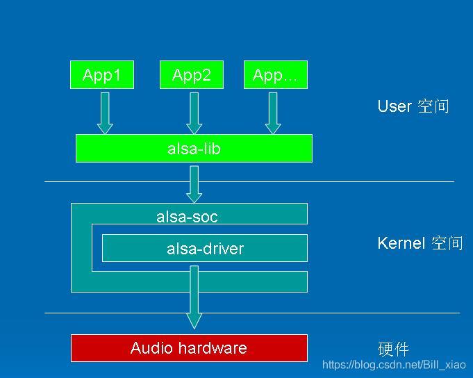
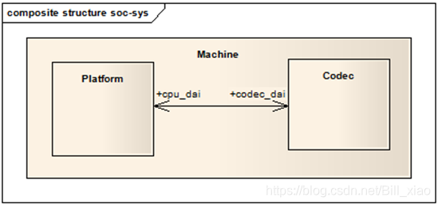

## 一 ALSA

ALSA, Advance Linux Sound Architecture，是linux的主流音频体系结构：

kernel/sound/core 目录包含前了ALSA驱动的中间层，是整个ALSA驱动的核心部分；

kernel/sound/soc 针对system-on-chip体系的中间层代码

**ASOC把音频系统分为3大部分：Machine, Platform和Codec**

platform一般指一个SOC平台，包含与音频相关的clock、i2s、dma等；

Codec 编解码器，指I2S 音频设备，包含DAC、ADC、PA等;

Machine 是指某一机器、某一开发板，为CPU、codec、输入输出设备提供一个载体，绑定platform driver和codec driver;

## 二、platform

paltform驱动主要作用是完成音频数据的管理，最终通过CPU的数据音频接口(DAI)--I2S总线把音频数据传送给Codec进行处理。

platform驱动分为俩个部分：snd_soc_platform_driver 负责管理音频数据，并把音频数据通过dma或其他操作传送指cpu dai中； snd_soc_dai_driver主要完成cpu一侧的dai的参数配置，同时也会通过一定的途径把必要的dma等参数与snd_soc_platform_driver进行交互。
